# Laporan Resmi Praktikum Jaringan Komputer Modul 5 - Firewall

## Identitas Kelompok
| Nama                                 | NRP        |
| -------------------------------------|------------|
| Rayssa Ravelia                       | 5025211219 |


## Soal
Setelah pandai mengatur jalur-jalur khusus, kalian diminta untuk membantu North Area menjaga wilayah mereka dan kalian dengan senang hati membantunya karena ini merupakan tugas terakhir. <br />
> (A). Tugas pertama, buatlah peta wilayah sesuai berikut ini:
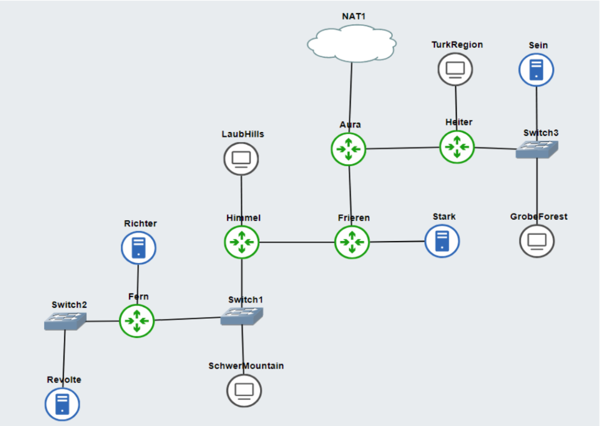

Keterangan:	
- Richter adalah DNS Server
- Revolte adalah DHCP Server
- Sein dan Stark adalah Web Server
- Jumlah Host pada SchwerMountain adalah 64
- Jumlah Host pada LaubHills adalah 255
- Jumlah Host pada TurkRegion adalah 1022
- Jumlah Host pada GrobeForest adalah 512

> (B). Untuk menghitung rute-rute yang diperlukan, gunakan perhitungan dengan metode VLSM. Buat juga pohonnya, dan lingkari subnet yang dilewati.

> (C). Kemudian buatlah rute sesuai dengan pembagian IP yang kalian lakukan. 

> (D). Tugas berikutnya adalah memberikan ip pada subnet SchwerMountain, LaubHills, TurkRegion, dan GrobeForest menggunakan bantuan DHCP.

Soal:
1. Agar topologi yang kalian buat dapat mengakses keluar, kalian diminta untuk mengkonfigurasi Aura menggunakan iptables, tetapi tidak ingin menggunakan MASQUERADE.
2. Kalian diminta untuk melakukan drop semua TCP dan UDP kecuali port 8080 pada TCP.
3. Kepala Suku North Area meminta kalian untuk membatasi DHCP dan DNS Server hanya dapat dilakukan ping oleh maksimal 3 device secara bersamaan, selebihnya akan di drop.
4. Lakukan pembatasan sehingga koneksi SSH pada Web Server hanya dapat dilakukan oleh masyarakat yang berada pada GrobeForest.
5. Selain itu, akses menuju WebServer hanya diperbolehkan saat jam kerja yaitu Senin-Jumat pada pukul 08.00-16.00.
6. Lalu, karena ternyata terdapat beberapa waktu di mana network administrator dari WebServer tidak bisa stand by, sehingga perlu ditambahkan rule bahwa akses pada hari Senin - Kamis pada jam 12.00 - 13.00 dilarang (istirahat maksi cuy) dan akses di hari Jumat pada jam 11.00 - 13.00 juga dilarang (maklum, Jumatan rek).
7. Karena terdapat 2 WebServer, kalian diminta agar setiap client yang mengakses Sein dengan Port 80 akan didistribusikan secara bergantian pada Sein dan Stark secara berurutan dan request dari client yang mengakses Stark dengan port 443 akan didistribusikan secara bergantian pada Sein dan Stark secara berurutan.
8. Karena berbeda koalisi politik, maka subnet dengan masyarakat yang berada pada Revolte dilarang keras mengakses WebServer hingga masa pencoblosan pemilu kepala suku 2024 berakhir. Masa pemilu (hingga pemungutan dan penghitungan suara selesai) kepala suku bersamaan dengan masa pemilu Presiden dan Wakil Presiden Indonesia 2024.
9. Sadar akan adanya potensial saling serang antar kubu politik, maka WebServer harus dapat secara otomatis memblokir  alamat IP yang melakukan scanning port dalam jumlah banyak (maksimal 20 scan port) di dalam selang waktu 10 menit. 
(clue: test dengan nmap)
10. Karena kepala suku ingin tau paket apa saja yang di-drop, maka di setiap node server dan router ditambahkan logging paket yang di-drop dengan standard syslog level. 

Agar silaturahmi tidak terputus, jangan lupa agar semua aturan iptables harus disimpan pada sistem atau paling tidak kalian menyediakan script sebagai backup.

## Jawab
### Jawaban Soal A
> Buatlah peta wilayah!

Berikut ini adalah topologi yang telah dibuat sesuai dengan soal:
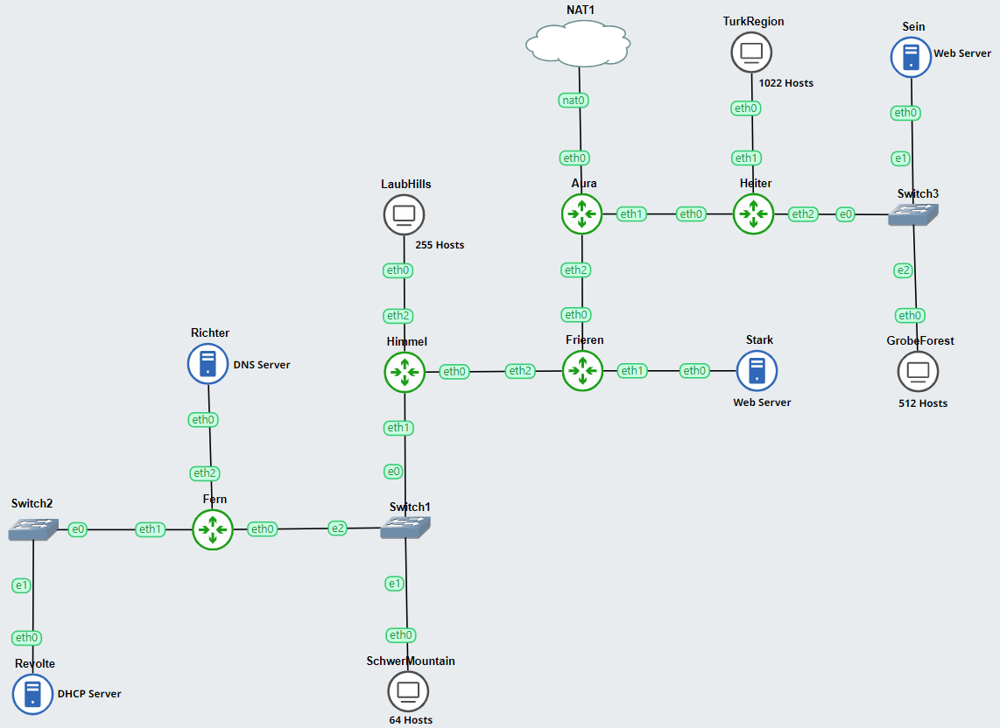

### Jawaban Soal B
> (B). Untuk menghitung rute-rute yang diperlukan, gunakan perhitungan dengan metode VLSM. Buat juga pohonnya, dan lingkari subnet yang dilewati.

Untuk membagi IP menggunakan metode VLSM, kita harus menentukan subnet terlebih dahulu. Berikut ini adalah subnet yang telah saya tentukan:

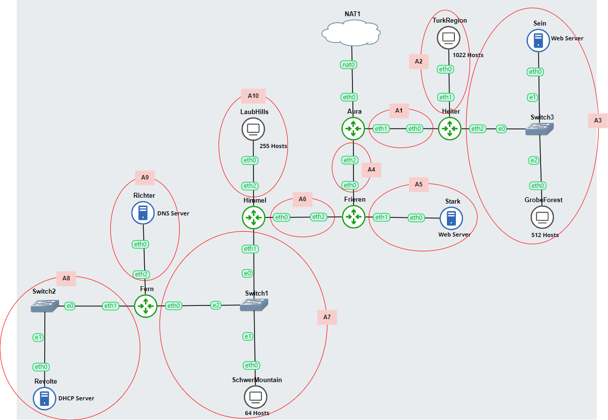

Terdapat 10 subnet yang terbentuk dari A1 hingga A10. Urutan subnetting yang saya lakukan menggunakan urutan Depth First Search (DFS) yang berawal dari Router Aura dan mengikuti arah jarum jam (clockwise).

Adapun tabel subnet untuk setiap netmask length sebagai berikut:

*Tabel 1. Subnet*
| Addresses | Usable IPs | Length | Subnet Mask       | Wildcard       |
|-----------|------------|--------|-------------------|----------------|
| 1         | 1          | /32    | 255.255.255.255   | 0.0.0.0        |
| 2         | NA         | /31    | 255.255.255.254   | 0.0.0.1        |
| 4         | 2          | /30    | 255.255.255.252   | 0.0.0.3        |
| 8         | 6          | /29    | 255.255.255.248   | 0.0.0.7        |
| 16        | 14         | /28    | 255.255.255.240   | 0.0.0.15       |
| 32        | 30         | /27    | 255.255.255.224   | 0.0.0.31       |
| 64        | 62         | /26    | 255.255.255.192   | 0.0.0.63       |
| 128       | 126        | /25    | 255.255.255.128   | 0.0.0.127      |
| 256       | 254        | /24    | 255.255.255.0     | 0.0.0.255      |
| 512       | 510        | /23    | 255.255.254.0     | 0.0.1.255      |
| 1024      | 1022       | /22    | 255.255.252.0     | 0.0.3.255      |
| 2048      | 2046       | /21    | 255.255.248.0     | 0.0.7.255      |
| 4096      | 4094       | /20    | 255.255.240.0     | 0.0.15.255     |
| 8192      | 8190       | /19    | 255.255.224.0     | 0.0.31.255     |
| 16384     | 16382      | /18    | 255.255.192.0     | 0.0.63.255     |
| 32768     | 32766      | /17    | 255.255.128.0     | 0.0.127.255    |
| 65536     | 65534      | /16    | 255.255.0.0       | 0.0.255.255    |
| 131072    | 131070     | /15    | 255.254.0.0       | 0.1.255.255    |
| 262144    | 262142     | /14    | 255.252.0.0       | 0.3.255.255    |
| 524288    | 524286     | /13    | 255.248.0.0       | 0.7.255.255    |
| 1048576   | 1048574    | /12    | 255.240.0.0       | 0.15.255.255   |
| 2097152   | 2097150    | /11    | 255.224.0.0       | 0.31.255.255   |
| 4194304   | 4194302    | /10    | 255.192.0.0       | 0.63.255.255   |
| 8388608   | 8388606    | /9     | 255.128.0.0       | 0.127.255.255  |
| 16777216  | 16777214   | /8     | 255.0.0.0         | 0.255.255.255  |


Berikut ini adalah tabel rute topologi berdasarkan subnetting yang telah dilakukan dan Subnet Mask diperoleh dari tabel subnet sebelumnya:

*Tabel 2. Rute topologi subnetting*
| Nama Subnet | Rute                                             | Jumlah IP | Netmask Length | Subnet Mask       |
|-------------|--------------------------------------------------|-----------|----------------|-------------------|
| A1          | Aura - Heiter                                    | 2         | /30            | 255.255.255.252   |
| A2          | Heiter - TurkRegion                              | 1023      | /21            | 255.255.248.0     |
| A3          | Heiter - Switch3 - Sein - Switch3- GrobeForest   | 514       | /22            | 255.255.252.0     |
| A4          | Aura - Frieren                                   | 2         | /30            | 255.255.255.252   |
| A5          | Frieren - Stark                                  | 2         | /30            | 255.255.255.252   |
| A6          | Frieren - Himmel                                 | 2         | /30            | 255.255.255.252   |
| A7          | Himmel - Switch1 - SchwerMountain - Switch1 - Fern | 66        | /25            | 255.255.255.128   |
| A8          | Fern - Switch2 - Revolte                         | 2         | /30            | 255.255.255.252   |
| A9          | Fern - Richter                                   | 2         | /30            | 255.255.255.252   |
| A10         | Himmel - LaubHills                               | 256       | /23            | 255.255.254.0     |
| **Total**   |                                                  | **1871**  | **/20**        | **255.255.240.0** |

Untuk melakukan perhitungan IP metode VLSM, kita harus membuat tree VLSM terlebih dahulu yang berdasarkan tabel 2. Untuk major network yang digunakan adalah `192.180.0.0/20` yang dimana `192.180` merupakan Prefix IP kelompok saya dan `/20` diperoleh dari subnet mask yang mencukupi topologi tersebut berdasarkan total IP pada tabel 2. 

Major network yang digunakan adalah `192.180.0.0/20` bukan `192.180.1.0/20` sebab `/20` menunjukkan bahwa 20 bit pertama dari alamat IP adalah netmask yang menentukan network identifier. Dalam hal ini, netmasknya adalah `255.255.240.0`, yang berarti bahwa alamat jaringan harus memiliki 20 bit pertama yang sama dan sisanya boleh berbeda. 

Alamat `192.180.0.0` secara implisit memiliki 20 bit pertama yang sama dan sisanya adalah nol, yang sesuai dengan definisi alamat jaringan dalam subnetting. Sebaliknya, alamat `192.180.1.0/20` salah dianggap sebagai alamat jaringan karena bit ke-17 dan ke-18 (dalam format biner) berubah dari 00 (dalam 192.180.0.0) menjadi 01, yang berarti alamat tersebut bukanlah permulaan dari blok alamat yang ditentukan oleh netmask /20 tetapi sebenarnya sebuah alamat host dalam blok alamat tersebut. Dalam subnetting, alamat jaringan harus memiliki semua host bits diatur ke nol, dan `192.180.1.0` tidak memenuhi kriteria ini jika netmasknya adalah `/20`.

Untuk membuat tree, kita harus berbasis dari tabel 1 dan tabel 2. Major IP memiliki netmask length `/20` yang berarti memiliki address sebesar `4096` berdasarkan tabel 1. Selanjutnya, major IP tersebut dipecah menjadi 2 bagian sehingga menjadi `192.180.0.0/21` dan `192.180.16.0/21`. IP `192.180.16.0/21` diperoleh dari `192.180.0.0/20`ditambah dengan banyaknya address untuk `/20`yaitu 4096 sehingga diperoleh `192.180.16.0/20`. Langkah ini diulangi terus menerus sehingga didapatkan IP sesuai dengan jumlah yang diinginkan pada tabel 2. 

Berikut ini adalah tree VLSM yang telah dibuat:
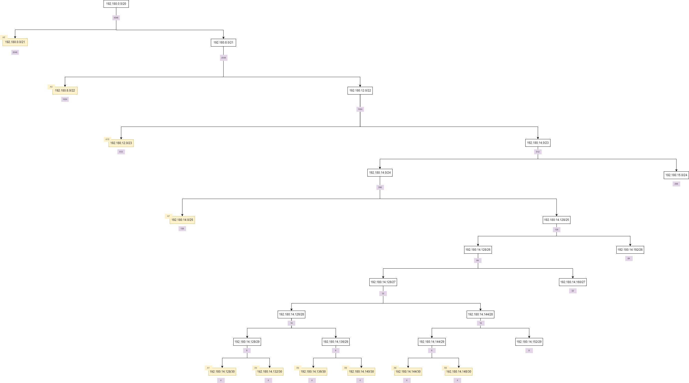

Pada tree yang saya buat selalu memecah bagian kiri terlebih dahulu agar perhitungan menjadi lebih mudah. 

Berdasarkan tree tersebut sudah didapatkan IP untuk 10 subnet yang ada. Maka kita dapat membuat tabel IP VLSM berdasarkan urutan subnet mask terbesar sebagai berikut:

*Tabel 3. IP VLSM berdarkan subnet size terbesar*
| Subnet Name | Needed Size | Allocated Size | Address       | Mask | Dec Mask        | Assignable Range             | Broadcast       |
|-------------|-------------|----------------|---------------|------|-----------------|------------------------------|-----------------|
| A2          | 1023        | 2046           | 192.180.0.0   | /21  | 255.255.248.0   | 192.180.0.1 - 192.180.7.254  | 192.180.7.255   |
| A3          | 514         | 1022           | 192.180.8.0   | /22  | 255.255.252.0   | 192.180.8.1 - 192.180.11.254 | 192.180.11.255  |
| A10         | 256         | 510            | 192.180.12.0  | /23  | 255.255.254.0   | 192.180.12.1 - 192.180.13.254| 192.180.13.255  |
| A7          | 66          | 126            | 192.180.14.0  | /25  | 255.255.255.128 | 192.180.14.1 - 192.180.14.126| 192.180.14.127  |
| A1          | 2           | 2              | 192.180.14.128| /30  | 255.255.255.252 | 192.180.14.129 - 192.180.14.130| 192.180.14.131 |
| A4          | 2           | 2              | 192.180.14.132| /30  | 255.255.255.252 | 192.180.14.133 - 192.180.14.134| 192.180.14.135 |
| A5          | 2           | 2              | 192.180.14.136| /30  | 255.255.255.252 | 192.180.14.137 - 192.180.14.138| 192.180.14.139 |
| A6          | 2           | 2              | 192.180.14.140| /30  | 255.255.255.252 | 192.180.14.141 - 192.180.14.142| 192.180.14.143 |
| A8          | 2           | 2              | 192.180.14.144| /30  | 255.255.255.252 | 192.180.14.145 - 192.180.14.146| 192.180.14.147 |
| A9          | 2           | 2              | 192.180.14.148| /30  | 255.255.255.252 | 192.180.14.149 - 192.180.14.150| 192.180.14.151 |

Adapun tabel IP VLSM berdasarkan urutan subnet sebagai berikut:

*Tabel 4. IP VLSM berdasarkan urutan subnet*
| Subnet | Network ID       | Netmask            | Broadcast        |
|--------|------------------|--------------------|------------------|
| A1     | 192.180.14.128   | 255.255.255.252    | 192.180.14.131   |
| A2     | 192.180.0.0      | 255.255.248.0      | 192.180.7.255    |
| A3     | 192.180.8.0      | 255.255.252.0      | 192.180.11.255   |
| A4     | 192.180.14.132   | 255.255.255.252    | 192.180.14.135   |
| A5     | 192.180.14.136   | 255.255.255.252    | 192.180.14.139   |
| A6     | 192.180.14.140   | 255.255.255.252    | 192.180.14.143   |
| A7     | 192.180.14.0     | 255.255.255.128    | 192.180.14.127   |
| A8     | 192.180.14.144   | 255.255.255.252    | 192.180.14.147   |
| A9     | 192.180.14.148   | 255.255.255.252    | 192.180.14.151   |
| A10    | 192.180.12.0     | 255.255.254.0      | 192.180.13.255   |

Untuk konfigurasi IP addresses tersebut ke dalam GNS3, pertama-tama kita harus membuat topologi yang disertai dengan IP addresses untuk mempermudah konfigurasi. Berikut ini adalah topologi yang saya buat:

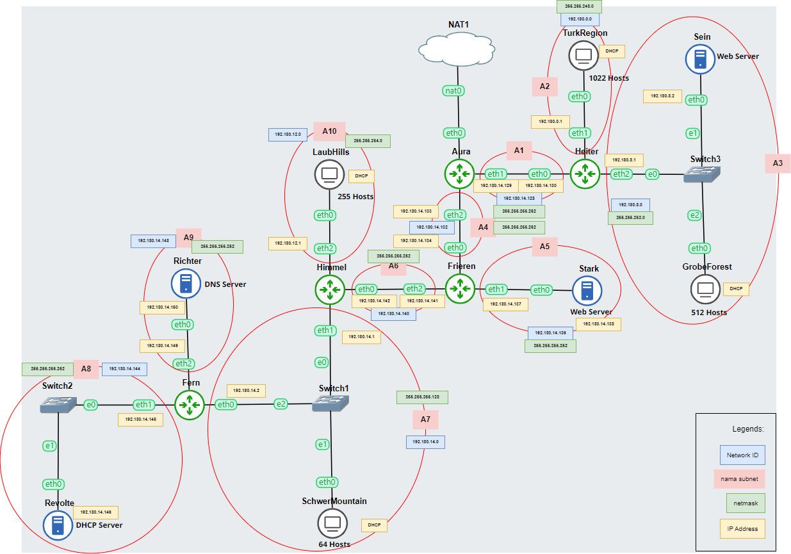

Berikut ini adalah tabel konfigurasi IP berdasarkan gambar di atas:

*Tabel 5. Konfigurasi IP Addresses*

| Node           | Subnet | Interface | IP Address | Netmask         | Gateway       |
|----------------|--------|-----------|------------|-----------------|---------------|
| Aura (Router)  | -      | eth0      | DHCP       | -               | -             |
|                | A1     | eth1      | 192.180.14.129 | 255.255.255.252 | -             |
|                | A4     | eth2      | 192.180.14.133| 255.255.255.252 | -             |
| Heiter (Router)| A1    | eth0      | 192.180.14.130| 255.255.255.252 | 192.180.14.129  |
|                | A2     | eth1      | 192.180.0.1   | 255.255.248.0   | -             |
|                | A3    | eth2      | 192.180.8.1   | 255.255.252.0   | -             |
| TurkRegion (1022 Hosts)     | A2     | eth0      | DHCP       | -               | -             |
| Sein (Web Server)  | A3    | eth0      | 192.180.8.2   | 255.255.252.0   | 192.180.8.1     |
| GrobeForest (512 Hosts)    | A3    | eth0      | DHCP       | -               | -             |
| Frieren (Router)| A4    | eth0      |192.180.14.134| 255.255.255.252 | 192.180.14.133  |
|                | A5     | eth1      | 192.180.14.137| 255.255.255.252 | -             |
|                | A6     | eth2      | 192.180.14.141| 255.255.255.252 | -             |
| Stark (Server) | A5     | eth0      | 192.180.14.138| 255.255.255.252 | 192.180.14.137  |
| LaubHills (255 Hosts)| A10  | eth0      | DHCP       | -               | -             |
| Himmel (Router)     | A6     | eth0      | 192.180.14.142| 255.255.255.252 | 192.180.14.141  |
|                     | A7     | eth1      | 192.180.14.1  | 255.255.255.128   | -             |
|                     | A10     | eth2      | 192.180.12.1  | 255.255.254.0 | -             |
| Fern (Router)       | A7     | eth0      | 192.180.14.2  | 255.255.255.128 | 192.180.14.1    |
|                     | A8     | eth1      | 192.180.14.145| 255.255.255.252 | -             |
|                     | A9     | eth2      | 192.180.14.149| 255.255.255.252 | -             |
| Richter (DNS Server)    | A9     | eth0      | 192.180.14.150| 255.255.255.252 | 192.180.14.149  |
| SchwerMountains (64 Hosts) | A7 | eth0    | DHCP       | -               | -             |
| Revolte (DHCP Server)    | A8     | eth0      | 192.180.14.146| 255.255.255.252 | 192.180.14.145  |


Kemudian, lakukan konfigurasi IP sesuai dengan gambar di atas, `netmask` disesuaikan dengan nama subnet dan subnet masknya pada tabel 4. 

Pada setiap `eth0` ditambahkan gateway untuk IP address tersebut, dan juga tambahkan `up echo nameserver 192.168.122.1 > /etc/resolv.conf` agar dapat terhubung ke NAT1. 

Berikut ini adalah konfigurasi untuk setiap node yang saya lakukan:
- Aura (Router)
    ```
    #NAT
    auto eth0
    iface eth0 inet dhcp

    #A1
    auto eth1
    iface eth1 inet static
        address 192.180.14.129
        netmask 255.255.255.252

    #A4
    auto eth2
    iface eth2 inet static
        address 192.180.14.133
        netmask 255.255.255.252
    ```
- Heiter (Router)
    ```
    #A1
    auto eth0
    iface eth0 inet static
        address 192.180.14.130
        netmask 255.255.255.252
        gateway 192.180.14.129
    up echo nameserver 192.168.122.1 > /etc/resolv.conf

    #A2
    auto eth1
    iface eth1 inet static
        address 192.180.0.1
        netmask 255.255.248.0

    #A3
    auto eth2
    iface eth2 inet static
        address 192.180.8.1
        netmask 255.255.252.0
    ```
- TurkRegion (1022 Hosts)
    ```
    auto eth0
    iface eth0 inet dhcp
    ```
- Sein (Web Server)
    ```
    #A3
    auto eth0
    iface eth0 inet static
        address 192.180.8.2
        netmask 255.255.252.0
        gateway 192.180.8.1
    up echo nameserver 192.168.122.1 > /etc/resolv.conf
    ```
- GrobeForest (512 Hosts)
    ```
    auto eth0
    iface eth0 inet dhcp
    ```
- Frieren 
    ```
    #A4
    auto eth0
    iface eth0 inet static
        address 192.180.14.134
        netmask 255.255.255.252
        gateway 192.180.14.133
    up echo nameserver 192.168.122.1 > /etc/resolv.conf

    #A5
    auto eth1
    iface eth1 inet static
        address 192.180.14.137
        netmask 255.255.255.252

    #A6
    auto eth2
    iface eth2 inet static
        address 192.180.14.141
        netmask 255.255.255.252
    ```
- Stark (Web Server)
    ```
    #A5
    auto eth0
    iface eth0 inet static
        address 192.180.14.138
        netmask 255.255.255.252
        gateway 192.180.14.137
    up echo nameserver 192.168.122.1 > /etc/resolv.conf
    ```
- Himmel
    ```
    #A6
    auto eth0
    iface eth0 inet static
        address 192.180.14.142
        netmask 255.255.255.252
        gateway 192.180.14.141
    up echo nameserver 192.168.122.1 > /etc/resolv.conf

    #A7
    auto eth1
    iface eth1 inet static
        address 192.180.14.1
        netmask 255.255.255.128

    #A10
    auto eth2
    iface eth2 inet static
        address 192.180.12.1
        netmask 255.255.254.0
    ```
- LaubHills (255 Hosts)
    ```
    auto eth0
    iface eth0 inet dhcp
    ```
- SchwerMountain (64 Hosts)
    ```
    auto eth0
    iface eth0 inet dhcp
    ```
- Fern
    ```
    #A7
    auto eth0
    iface eth0 inet static
        address 192.180.14.2
        netmask 255.255.255.128
        gateway 192.180.14.1
    up echo nameserver 192.168.122.1 > /etc/resolv.conf

    #A8
    auto eth1
    iface eth1 inet static
        address 192.180.14.145
        netmask 255.255.255.252

    #A9
    auto eth2
    iface eth2 inet static
        address 192.180.14.149
        netmask 255.255.255.252
    ```
- Richter (DNS Server)
    ```
    #A9
    auto eth0
    iface eth0 inet static
        address 192.180.14.150
        netmask 255.255.255.252
        gateway 192.180.14.149
    up echo nameserver 192.168.122.1 > /etc/resolv.conf
    ```
- Revolte (DHCP Server)
    ```
    #A8
    auto eth0
    iface eth0 inet static
        address 192.180.14.146
        netmask 255.255.255.252
        gateway 192.180.14.145
    up echo nameserver 192.168.122.1 > /etc/resolv.conf
    ```
### Jawaban Soal C
> (C). Kemudian buatlah rute sesuai dengan pembagian IP yang kalian lakukan. 

Agar setiap node dapat terhubung satu sama lain, kita perlu melakukan routing IP pada implementasi IP yang sudah kita lakukan sebelumnya.

Untuk melakukan routing pada GNS3, kita harus melihat dari setiap subnet masing-masing dan routernya. Jika subnet tersebut langsung berhubungan dengan router melalui kabel yang sama, maka kita tidak perlu melakukan routing pada router tersebut.

Sebagai contoh untuk subnet A2 yang memiliki NID 192.180.0.0


Subnet A2 tersebut berhubungan secara langsung dengan Router Heiter, maka kita tidak perlu melakukan konfigurasi routing pada Heiter. Tujuan routing adalah untuk menuju pusatnya, yaitu router Aura. Router Aura tidak berhubungan langsung dengan subnet A2, oleh karena itu kita perlu melakukan konfigurasi routing subnet A2 di router Aura.

Konfigurasi tersebut disimpan di dalam *.bashrc*, dengan format sebagai berikut:

```
route add -net [Network ID] netmask [Netmask] gw [Gateway]
```

Kita ingin menambahkan rute subnet A2 di dalam Router Aura, maka Network ID yang dimasukkan adalah subnet A2, yaitu `192.180.0.0`. Subnet A2 memiliki netmask `255.255.248.0` . Untuk gateway, dilihat dari kabel router Aura yang paling dekat dengan subnet A2, yaitu `Heiter eth 0`, yang memiliki IP `192.180.14.130`

Maka command untuk menambahkan subnet A2 di routing adalah:

```
route add -net 192.180.0.0 netmask 255.255.248.0 gw 192.180.14.130
```

Lakukan hal yang sama untuk subnet lainnya. Berikut ini adalah routing yang saya lakukan:
- Aura 
    ```
    #Routing for Aura's eth1 paths
    #A2
    route add -net 192.180.0.0 netmask 255.255.248.0 gw 192.180.14.130

    #A3
    route add -net 192.180.8.0 netmask 255.255.252.0 gw 192.180.14.130

    #Routing for Aura's eth2 paths
    #A5
    route add -net 192.180.14.136 netmask 255.255.255.252 gw 192.180.14.134

    #A6
    route add -net 192.180.14.140 netmask 255.255.255.252 gw 192.180.14.134

    #A10
    route add -net 192.180.12.0 netmask 255.255.254.0 gw 192.180.14.134

    #A7
    route add -net 192.180.14.0 netmask 255.255.255.128 gw 192.180.14.134

    #A8
    route add -net 192.180.14.144 netmask 255.255.255.252 gw 192.180.14.134

    #A9
    route add -net 192.180.14.148 netmask 255.255.255.252 gw 192.180.14.134
    ```
- Frieren
    ```
     #Routing for Frieren's eth2 paths
    #A10
    route add -net 192.180.12.0 netmask 255.255.254.0 gw 192.180.14.142

    #A7
    route add -net 192.180.14.0 netmask 255.255.255.128 gw 192.180.14.142

    #A8
    route add -net 192.180.14.144 netmask 255.255.255.252 gw 192.180.14.142

    #A9
    route add -net 192.180.14.148 netmask 255.255.255.252 gw 192.180.14.142
    ```
- Himmel
    ```
    #Routing for Himmel's eth1 paths
    #A8
    route add -net 192.180.14.144 netmask 255.255.255.252 gw 192.180.14.2

    #A9
    route add -net 192.180.14.148 netmask 255.255.255.252 gw 192.180.14.2
    ```

### Jawaban Soal D
> (D). Tugas berikutnya adalah memberikan ip pada subnet SchwerMountain, LaubHills, TurkRegion, dan GrobeForest menggunakan bantuan DHCP.

#### D.1. Mengunduh Dependencies
Untuk mengatur IP DHCP pada Hosts, terdapat beberapa konfigurasi awal yang harus dilakukan pada beberapa node yang disimpan pada `.bashrc` untuk mengunduh dependencies. Berikut ini adalah konfigurasi yang dilakukan:
1. Konfigurasi DHCP
    ```
    apt-get update -y
    apt-get install isc-dhcp-server -y
    ```

    Konfigurasi di atas dilakukan pada node:
    - DHCP Server: 
        - Revolte
    - DHCP Relay:
        - Aura
        - Heiter
        - Frieren
        - Himmel
        - Fern
    
    Perintah `apt-get update -y` dan `apt-get install isc-dhcp-server -y` adalah bagian dari proses konfigurasi untuk menyiapkan sebuah server DHCP pada sistem operasi berbasis Linux. <br /> 
    
    Pertama, `apt-get update -y` digunakan untuk memperbarui daftar paket dan versi mereka yang tersedia. Ini memastikan bahwa sistem memiliki informasi terbaru tentang paket yang dapat diinstal atau diperbarui, termasuk keamanan dan pembaruan perangkat lunak penting. Kemudian, `apt-get install isc-dhcp-server -y` digunakan untuk menginstal paket `isc-dhcp-server`, yang merupakan implementasi server DHCP. Server DHCP (Dynamic Host Configuration Protocol) adalah server yang memberikan konfigurasi IP secara dinamis kepada klien di jaringan. <br />

    Pada skenario ini, konfigurasi tersebut diaplikasikan pada node yang berfungsi sebagai DHCP Server dan DHCP Relay, dengan DHCP Relay berperan sebagai perantara yang meneruskan permintaan DHCP dari klien ke server.

2. Konfigurasi DNS
    ```
    apt-get update
    apt-get install install bind9 -y
    ```
    Konfigurasi di atas diterapka pada DNS Server, yaitu node Richter.

    Perintah `apt-get update` diikuti oleh `apt-get install bind9 -y` merupakan tahapan konfigurasi untuk menyiapkan sebuah server DNS menggunakan BIND9 pada sistem operasi berbasis Linux. 
    
    Pertama, `apt-get update` digunakan untuk menyegarkan repositori paket sistem. Ini memastikan bahwa sistem memiliki informasi terbaru tentang semua paket yang tersedia, termasuk pembaruan keamanan dan perbaikan bug. Setelah repositori diperbarui, `apt-get install bind9 -y` digunakan untuk menginstal BIND9, yang merupakan salah satu perangkat lunak server DNS yang paling banyak digunakan. BIND9 (Berkeley Internet Name Domain version 9) memungkinkan server untuk menerjemahkan nama domain menjadi alamat IP, memfasilitasi penemuan sumber daya di internet. 
    
    Dalam konteks ini, kode tersebut digunakan untuk mengatur server DNS, yang bertanggung jawab atas penyelesaian nama domain dalam jaringan atau di internet.

#### D.2. Konfigurasi pada root
Setelah dependencies terunduh, terdapat beberapa konfigurasi lain yang harus dilakukan pada beberapa node yang disimpan pada `root`. Hal ini dikarenakan di dalam GNS3, program yang tersimpan di dalam `root` tidak akan hilang jika node tersebut di restart. Berikut ini adalah konfigurasi yang dilakukan:

1. Konfigurasi DHCP
    - DHCP Server

        Revolte yang berperan sebagai DHCP Server memiliki konfigurasi sebagai berikut, yang saya simpan di dalam `/root/start.sh`:
        ```
        rm /var/run/dhcpd.pid

        echo 'INTERFACESv4="eth0"' > /etc/default/isc-dhcp-server

        echo '
        #A1
        subnet 192.180.14.128 netmask 255.255.255.252 {
        }

        #A2
        subnet 192.180.0.0 netmask 255.255.248.0 {
            range 192.180.0.2 192.180.7.254;
                option routers 192.180.0.1;
                option broadcast-address 192.180.7.255;
                option domain-name-servers 192.180.14.150;
                default-lease-time 3600;
                max-lease-time 5760;
        }

        #A3
        subnet 192.180.8.0 netmask 255.255.252.0 {
            range 192.180.8.3 192.180.11.254;
                option routers 192.180.8.1;
                option broadcast-address 192.180.11.255;
                option domain-name-servers 192.180.14.150;
                default-lease-time 3600;
                max-lease-time 5760;
        }

        #A4
        subnet 192.180.14.132 netmask 255.255.255.252 {
        }

        #A5
        subnet 192.180.14.136 netmask 255.255.255.252 {
        }

        #A6
        subnet 192.180.14.140 netmask 255.255.255.252 {
        }

        #A7
        subnet 192.180.14.0 netmask 255.255.255.128 {
            range 192.180.14.3 192.180.14.126;
                option routers 192.180.14.1;
                option broadcast-address 192.180.14.127;
                option domain-name-servers 192.180.14.150;
                default-lease-time 3600;
                max-lease-time 5760;
        }

        #A8
        subnet 192.180.14.144 netmask 255.255.255.252 {
        }

        #A9
        subnet 192.180.14.148 netmask 255.255.255.252 {
        }

        #A10
        subnet 192.180.12.0 netmask 255.255.254.0 {
            range 192.180.12.2 192.180.13.254;
                option routers 192.180.12.1;
                option broadcast-address 192.180.13.255;
                option domain-name-servers 192.180.14.150;
                default-lease-time 3600;
                max-lease-time 5760;
        }
        ' > /etc/dhcp/dhcpd.conf

        service isc-dhcp-server stop
        service isc-dhcp-server start
        ```
        Konfigurasi ini mengatur Revolte sebagai DHCP Server. Pertama, file `dhcpd.pid` dihapus untuk menghilangkan proses ID dari sesi DHCP sebelumnya. Pengaturan `INTERFACESv4="eth0"` mendefinisikan antarmuka jaringan yang digunakan oleh server DHCP. 
        
        Berikutnya, konfigurasi untuk berbagai subnet ditetapkan dalam file `dhcpd.conf`. Ini termasuk pengaturan untuk alamat jaringan, masker subnet, rentang alamat IP yang dapat dialokasikan, gateway default, alamat broadcast, server DNS, dan waktu sewa IP. Beberapa subnet seperti 192.180.14.128 dan 192.180.14.132 hanya didefinisikan tanpa rentang alamat, menunjukkan mereka tidak mendistribusikan alamat IP. 
        
        Konfigurasi ini mencakup berbagai subnet dengan berbagai skema penugasan alamat. Setelah konfigurasi selesai, layanan `isc-dhcp-server` dihentikan dan kemudian dijalankan kembali untuk menerapkan perubahan. Ini memastikan server DHCP siap menangani permintaan dari klien di jaringan tersebut.
    
    - DHCP Relay <br />
    Untuk DHCP Relay, konfigurasi ini dilakukan pada:
        - Aura
        - Heiter
        - Frieren
        - Himmel
        - Fern
    Berikut ini adalah konfigurasi yang dilakukan yang saya simpan di dalam `/root/start.sh`:
        ```
        echo '
        SERVERS="192.180.14.146"
        INTERFACES="eth0 eth1 eth2"
        OPTIONS=
        ' > /etc/default/isc-dhcp-relay

        echo 'net.ipv4.ip_forward=1' > /etc/sysctl.conf

        service isc-dhcp-relay restart
        ```
        Konfigurasi ini menyiapkan sebuah sistem sebagai DHCP Relay. Pertama, file `/etc/default/isc-dhcp-relay` diatur untuk mendefinisikan parameter utama DHCP Relay. `SERVERS="192.180.14.146"` menetapkan alamat IP server DHCP (Revolte) yang akan menerima permintaan DHCP dari relay. 
        
        `INTERFACES="eth0 eth1 eth2"` mendefinisikan antarmuka jaringan yang akan relay gunakan untuk mendengarkan dan meneruskan permintaan DHCP. `OPTIONS=` dibiarkan kosong, yang berarti tidak ada opsi tambahan yang ditetapkan. Selanjutnya, `echo 'net.ipv4.ip_forward=1' > /etc/sysctl.conf` mengaktifkan IP forwarding pada sistem, yang penting agar DHCP Relay dapat meneruskan paket antara jaringan yang berbeda.
        
        Akhirnya, `service isc-dhcp-relay restart` digunakan untuk memulai ulang layanan DHCP Relay dengan konfigurasi baru, memungkinkannya untuk mulai meneruskan permintaan DHCP dari klien ke server yang ditentukan. Konfigurasi ini penting dalam jaringan yang lebih besar di mana klien dan server DHCP tidak berada pada subnet yang sama.

2. Konfigurasi DNS Server
Untuk DNS Server (Richter), berikut ini adalah konfigurasi yang dilakukan yang saya simpan di dalam `/root/start.sh`:
```
 echo '
 options {
 	directory "/var/cache/bind";
 	forwarders {
 		192.168.122.1;
 	};
 	// dnssec-validation auto;
 	allow-query{any;};
 	auth-nxdomain no;
 	listen-on-v6 { any; };
 };
 ' > /etc/bind/named.conf.options

 service bind9 start
```

Konfigurasi ini digunakan untuk menyiapkan pengaturan DNS server dengan menggunakan BIND9 di Linux. Pertama, file `/etc/bind/named.conf.options` dimodifikasi untuk menentukan opsi konfigurasi utama. Dalam file ini, direktori cache disetel ke `/var/cache/bind`. 

Forwarders diatur ke `192.168.122.1`, yang berarti bahwa permintaan DNS yang tidak dapat diselesaikan secara lokal akan diteruskan ke server DNS ini. Baris `// dnssec-validation auto;` dikomentari, yang berarti validasi DNSSEC tidak diaktifkan. `allow-query{any;}` mengizinkan semua klien untuk melakukan query ke server ini. `auth-nxdomain no` mengatur server untuk tidak memberi tanggapan otoritatif untuk domain yang tidak ada. `listen-on-v6 { any; }` mengizinkan server untuk mendengarkan permintaan pada IPv6. 

Setelah file konfigurasi dimodifikasi, `service bind9 start` dijalankan untuk memulai layanan BIND9, menerapkan pengaturan baru dan memulai operasi sebagai DNS server. Konfigurasi ini penting untuk mengatur bagaimana server DNS menangani permintaan dan meneruskan query yang tidak dapat diselesaikan.

#### D.3. Testing
Untuk mengecek apakah DHCP berhasil pada SchwerMountain, LaubHills, TurkRegion, dan GrobeForest, berikut ini adalah langkah testing yang dilakukan:

1. Kita perlu mengakses keluar terlebih dahulu untuk mengunduh dependencies, maka jalankan [jawaban nomor 1](#jawaban-soal-1) terlebih dahulu
2. Lakukan `bash start.sh` pada node DHCP Relay, yaitu:
    - Aura
    - Heiter
    - Frieren
    - Himmel
    - Fern
3. Lakukan `bash start.sh` pada node DHCP Server (Revolte)
4. Lakukan `bash start.sh` pada node DNS Server (Richter)
5. Restart semua client
6. Berikut ini adalah hasil IP yang diperoleh pada setiap client:
    - SchwerMountain
        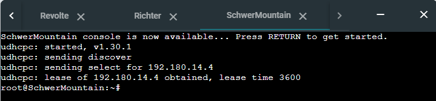

    - LaubHills
        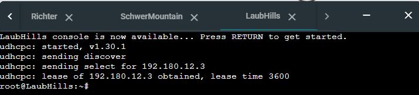

    - TurkRegion
        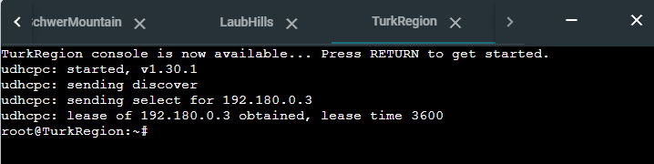

    - GrobeForest
        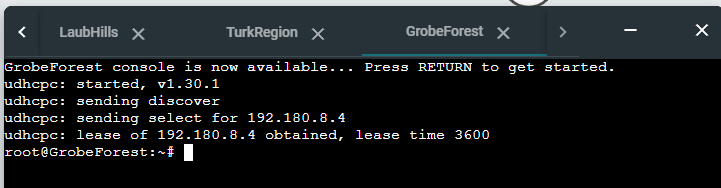

### Jawaban Soal 1
> Agar topologi yang kalian buat dapat mengakses keluar, kalian diminta untuk mengkonfigurasi Aura menggunakan iptables, tetapi tidak ingin menggunakan MASQUERADE.

#### 1.1. Solusi 
Lakukan perintah berikut di dalam node Aura:
```
ETH0_IP=$(ip -4 addr show eth0 | grep -oP '(?<=inet\s)\d+(\.\d+){3}')
```
```
iptables -t nat -A POSTROUTING -o eth0 -j SNAT --to-source $ETH0_IP
```

Konfigurasi ini menggunakan `iptables` untuk melakukan Network Address Translation (NAT) pada sebuah router Linux tanpa menggunakan `MASQUERADE`. Pertama, variabel `ETH0_IP` diisi dengan alamat IP dari antarmuka `eth0`. Ini dilakukan dengan perintah `ip -4 addr show eth0 | grep -oP '(?<=inet\s)\d+(\.\d+){3}'`, yang mencari dan mengekstrak alamat IPv4 yang diassign ke `eth0`.

Kemudian, `iptables` digunakan untuk menambahkan aturan NAT. Perintah `iptables -t nat -A POSTROUTING -o eth0 -j SNAT --to-source $ETH0_IP` mengatur NAT pada tabel `nat`, di rantai `POSTROUTING`, yang berlaku untuk paket yang keluar melalui `eth0`. `-j SNAT --to-source $ETH0_IP` menentukan bahwa sumber alamat IP pada paket yang keluar akan diubah menjadi alamat IP dari `eth0`.

Penggunaan `SNAT` (Source NAT) dengan alamat IP spesifik dibandingkan `MASQUERADE` memiliki keuntungan dalam hal efisiensi. `MASQUERADE` memeriksa alamat IP keluar setiap kali paket melewatinya, yang bisa menjadi mahal dalam hal pemrosesan jika alamat IP sering berubah. Namun, `SNAT` dengan alamat IP tetap lebih efisien karena transformasi dilakukan sekali saja. Ini cocok untuk skenario di mana alamat IP antarmuka tidak berubah sering, seperti pada router statis atau di lingkungan dengan alamat IP publik tetap.

#### 1.2. Testing
Untuk menjalankan testing, kita bisa melakukan perintah berikut pada node yang ingin diuji:
```
ping google.com
```
Berikut ini adalah hasil testing pada beberapa node:
- Router (Heiter)
    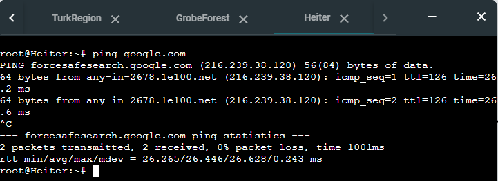

- Server (Stark)
    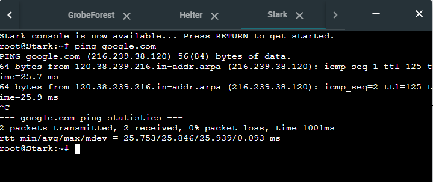

- Client
    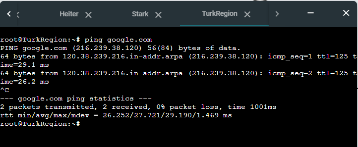
