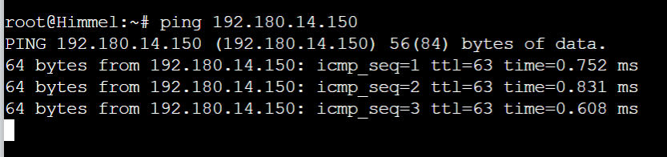
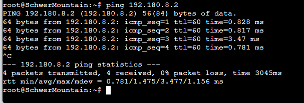
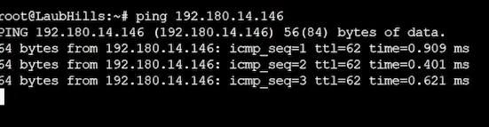

# Laporan Resmi Praktikum Jaringan Komputer Modul 5 - Firewall

## Identitas Kelompok
| Nama                                 | NRP        |
| -------------------------------------|------------|
| Rayssa Ravelia                       | 5025211219 |

## Daftar Isi
- [Soal](#soal) <br/>
- [Jawaban](#jawab) <br/>
    - [Jawaban Soal A](#jawaban-soal-a)
    - [Jawaban Soal B](#jawaban-soal-b)
    - [Jawaban Soal C](#jawaban-soal-c)
    - [Jawaban Soal D](#jawaban-soal-d)
    - [Jawaban Soal 1](#jawaban-soal-1)
        - [Solusi](#11-solusi)
        - [Testing](#12-testing)
    - [Jawaban Soal 2](#jawaban-soal-2)
        - [Solusi](#21-solusi)
        - [Testing](#22-testing)
    - [Jawaban Soal 3](#jawaban-soal-3)
        - [Solusi](#31-solusi)
        - [Testing](#32-testing)
    - [Jawaban Soal 4](#jawaban-soal-4)
        - [Solusi](#41-solusi)
        - [Testing](#42-testing)
    - [Jawaban Soal 5](#jawaban-soal-5)
        - [Solusi](#51-solusi)
        - [Testing](#52-testing)
    - [Jawaban Soal 6](#jawaban-soal-6)
        - [Solusi](#61-solusi)
        - [Testing](#62-testing)
    - [Jawaban Soal 7](#jawaban-soal-7)
        - [Solusi](#71-solusi)
        - [Testing](#72-testing)
    - [Jawaban Soal 8](#jawaban-soal-8)
        - [Solusi](#81-solusi)
        - [Testing](#82-testing)
    - [Jawaban Soal 9](#jawaban-soal-9)
        - [Solusi](#91-solusi)
        - [Testing](#92-testing)
    - [Jawaban Soal 10](#jawaban-soal-10)
        - [Solusi](#101-solusi)
        - [Testing](#102-testing)

## Soal
Setelah pandai mengatur jalur-jalur khusus, kalian diminta untuk membantu North Area menjaga wilayah mereka dan kalian dengan senang hati membantunya karena ini merupakan tugas terakhir. <br />
> (A). Tugas pertama, buatlah peta wilayah sesuai berikut ini:


Keterangan:	
- Richter adalah DNS Server
- Revolte adalah DHCP Server
- Sein dan Stark adalah Web Server
- Jumlah Host pada SchwerMountain adalah 64
- Jumlah Host pada LaubHills adalah 255
- Jumlah Host pada TurkRegion adalah 1022
- Jumlah Host pada GrobeForest adalah 512

> (B). Untuk menghitung rute-rute yang diperlukan, gunakan perhitungan dengan metode VLSM. Buat juga pohonnya, dan lingkari subnet yang dilewati.

> (C). Kemudian buatlah rute sesuai dengan pembagian IP yang kalian lakukan. 

> (D). Tugas berikutnya adalah memberikan ip pada subnet SchwerMountain, LaubHills, TurkRegion, dan GrobeForest menggunakan bantuan DHCP.

Soal:
1. Agar topologi yang kalian buat dapat mengakses keluar, kalian diminta untuk mengkonfigurasi Aura menggunakan iptables, tetapi tidak ingin menggunakan MASQUERADE.
2. Kalian diminta untuk melakukan drop semua TCP dan UDP kecuali port 8080 pada TCP.
3. Kepala Suku North Area meminta kalian untuk membatasi DHCP dan DNS Server hanya dapat dilakukan ping oleh maksimal 3 device secara bersamaan, selebihnya akan di drop.
4. Lakukan pembatasan sehingga koneksi SSH pada Web Server hanya dapat dilakukan oleh masyarakat yang berada pada GrobeForest.
5. Selain itu, akses menuju WebServer hanya diperbolehkan saat jam kerja yaitu Senin-Jumat pada pukul 08.00-16.00.
6. Lalu, karena ternyata terdapat beberapa waktu di mana network administrator dari WebServer tidak bisa stand by, sehingga perlu ditambahkan rule bahwa akses pada hari Senin - Kamis pada jam 12.00 - 13.00 dilarang (istirahat maksi cuy) dan akses di hari Jumat pada jam 11.00 - 13.00 juga dilarang (maklum, Jumatan rek).
7. Karena terdapat 2 WebServer, kalian diminta agar setiap client yang mengakses Sein dengan Port 80 akan didistribusikan secara bergantian pada Sein dan Stark secara berurutan dan request dari client yang mengakses Stark dengan port 443 akan didistribusikan secara bergantian pada Sein dan Stark secara berurutan.
8. Karena berbeda koalisi politik, maka subnet dengan masyarakat yang berada pada Revolte dilarang keras mengakses WebServer hingga masa pencoblosan pemilu kepala suku 2024 berakhir. Masa pemilu (hingga pemungutan dan penghitungan suara selesai) kepala suku bersamaan dengan masa pemilu Presiden dan Wakil Presiden Indonesia 2024.
9. Sadar akan adanya potensial saling serang antar kubu politik, maka WebServer harus dapat secara otomatis memblokir  alamat IP yang melakukan scanning port dalam jumlah banyak (maksimal 20 scan port) di dalam selang waktu 10 menit. 
(clue: test dengan nmap)
10. Karena kepala suku ingin tau paket apa saja yang di-drop, maka di setiap node server dan router ditambahkan logging paket yang di-drop dengan standard syslog level. 

Agar silaturahmi tidak terputus, jangan lupa agar semua aturan iptables harus disimpan pada sistem atau paling tidak kalian menyediakan script sebagai backup.

## Jawab
Adapun link demo untuk modul ini yang tertera pada [link demo](https://youtu.be/PYD5S4X7XQA?si=X8M82o8xl2DTpt53)

### ⭐ Jawaban Soal A
> Buatlah peta wilayah!

Berikut ini adalah topologi yang telah dibuat sesuai dengan soal:


### ⭐ Jawaban Soal B
> (B). Untuk menghitung rute-rute yang diperlukan, gunakan perhitungan dengan metode VLSM. Buat juga pohonnya, dan lingkari subnet yang dilewati.

Untuk membagi IP menggunakan metode VLSM, kita harus menentukan subnet terlebih dahulu. Berikut ini adalah subnet yang telah saya tentukan:


Terdapat 10 subnet yang terbentuk dari A1 hingga A10. Urutan subnetting yang saya lakukan menggunakan urutan Depth First Search (DFS) yang berawal dari Router Aura dan mengikuti arah jarum jam (clockwise).

Adapun tabel subnet untuk setiap netmask length sebagai berikut:

*Tabel 1. Subnet*
| Addresses | Usable IPs | Length | Subnet Mask       | Wildcard       |
|-----------|------------|--------|-------------------|----------------|
| 1         | 1          | /32    | 255.255.255.255   | 0.0.0.0        |
| 2         | NA         | /31    | 255.255.255.254   | 0.0.0.1        |
| 4         | 2          | /30    | 255.255.255.252   | 0.0.0.3        |
| 8         | 6          | /29    | 255.255.255.248   | 0.0.0.7        |
| 16        | 14         | /28    | 255.255.255.240   | 0.0.0.15       |
| 32        | 30         | /27    | 255.255.255.224   | 0.0.0.31       |
| 64        | 62         | /26    | 255.255.255.192   | 0.0.0.63       |
| 128       | 126        | /25    | 255.255.255.128   | 0.0.0.127      |
| 256       | 254        | /24    | 255.255.255.0     | 0.0.0.255      |
| 512       | 510        | /23    | 255.255.254.0     | 0.0.1.255      |
| 1024      | 1022       | /22    | 255.255.252.0     | 0.0.3.255      |
| 2048      | 2046       | /21    | 255.255.248.0     | 0.0.7.255      |
| 4096      | 4094       | /20    | 255.255.240.0     | 0.0.15.255     |
| 8192      | 8190       | /19    | 255.255.224.0     | 0.0.31.255     |
| 16384     | 16382      | /18    | 255.255.192.0     | 0.0.63.255     |
| 32768     | 32766      | /17    | 255.255.128.0     | 0.0.127.255    |
| 65536     | 65534      | /16    | 255.255.0.0       | 0.0.255.255    |
| 131072    | 131070     | /15    | 255.254.0.0       | 0.1.255.255    |
| 262144    | 262142     | /14    | 255.252.0.0       | 0.3.255.255    |
| 524288    | 524286     | /13    | 255.248.0.0       | 0.7.255.255    |
| 1048576   | 1048574    | /12    | 255.240.0.0       | 0.15.255.255   |
| 2097152   | 2097150    | /11    | 255.224.0.0       | 0.31.255.255   |
| 4194304   | 4194302    | /10    | 255.192.0.0       | 0.63.255.255   |
| 8388608   | 8388606    | /9     | 255.128.0.0       | 0.127.255.255  |
| 16777216  | 16777214   | /8     | 255.0.0.0         | 0.255.255.255  |


Berikut ini adalah tabel rute topologi berdasarkan subnetting yang telah dilakukan dan Subnet Mask diperoleh dari tabel subnet sebelumnya:

*Tabel 2. Rute topologi subnetting*
| Nama Subnet | Rute                                             | Jumlah IP | Netmask Length | Subnet Mask       |
|-------------|--------------------------------------------------|-----------|----------------|-------------------|
| A1          | Aura - Heiter                                    | 2         | /30            | 255.255.255.252   |
| A2          | Heiter - TurkRegion                              | 1023      | /21            | 255.255.248.0     |
| A3          | Heiter - Switch3 - Sein - Switch3- GrobeForest   | 514       | /22            | 255.255.252.0     |
| A4          | Aura - Frieren                                   | 2         | /30            | 255.255.255.252   |
| A5          | Frieren - Stark                                  | 2         | /30            | 255.255.255.252   |
| A6          | Frieren - Himmel                                 | 2         | /30            | 255.255.255.252   |
| A7          | Himmel - Switch1 - SchwerMountain - Switch1 - Fern | 66        | /25            | 255.255.255.128   |
| A8          | Fern - Switch2 - Revolte                         | 2         | /30            | 255.255.255.252   |
| A9          | Fern - Richter                                   | 2         | /30            | 255.255.255.252   |
| A10         | Himmel - LaubHills                               | 256       | /23            | 255.255.254.0     |
| **Total**   |                                                  | **1871**  | **/20**        | **255.255.240.0** |

Untuk melakukan perhitungan IP metode VLSM, kita harus membuat tree VLSM terlebih dahulu yang berdasarkan tabel 2. Untuk major network yang digunakan adalah `192.180.0.0/20` yang dimana `192.180` merupakan Prefix IP kelompok saya dan `/20` diperoleh dari subnet mask yang mencukupi topologi tersebut berdasarkan total IP pada tabel 2. 

Major network yang digunakan adalah `192.180.0.0/20` bukan `192.180.1.0/20` sebab `/20` menunjukkan bahwa 20 bit pertama dari alamat IP adalah netmask yang menentukan network identifier. Dalam hal ini, netmasknya adalah `255.255.240.0`, yang berarti bahwa alamat jaringan harus memiliki 20 bit pertama yang sama dan sisanya boleh berbeda. 

Alamat `192.180.0.0` secara implisit memiliki 20 bit pertama yang sama dan sisanya adalah nol, yang sesuai dengan definisi alamat jaringan dalam subnetting. Sebaliknya, alamat `192.180.1.0/20` salah dianggap sebagai alamat jaringan karena bit ke-17 dan ke-18 (dalam format biner) berubah dari 00 (dalam 192.180.0.0) menjadi 01, yang berarti alamat tersebut bukanlah permulaan dari blok alamat yang ditentukan oleh netmask /20 tetapi sebenarnya sebuah alamat host dalam blok alamat tersebut. Dalam subnetting, alamat jaringan harus memiliki semua host bits diatur ke nol, dan `192.180.1.0` tidak memenuhi kriteria ini jika netmasknya adalah `/20`.

Untuk membuat tree, kita harus berbasis dari tabel 1 dan tabel 2. Major IP memiliki netmask length `/20` yang berarti memiliki address sebesar `4096` berdasarkan tabel 1. Selanjutnya, major IP tersebut dipecah menjadi 2 bagian sehingga menjadi `192.180.0.0/21` dan `192.180.16.0/21`. IP `192.180.16.0/21` diperoleh dari `192.180.0.0/20`ditambah dengan banyaknya address untuk `/20`yaitu 4096 sehingga diperoleh `192.180.16.0/20`. Langkah ini diulangi terus menerus sehingga didapatkan IP sesuai dengan jumlah yang diinginkan pada tabel 2. 

Berikut ini adalah tree VLSM yang telah dibuat:


Pada tree yang saya buat selalu memecah bagian kiri terlebih dahulu agar perhitungan menjadi lebih mudah. 

Berdasarkan tree tersebut sudah didapatkan IP untuk 10 subnet yang ada. Maka kita dapat membuat tabel IP VLSM berdasarkan urutan subnet mask terbesar sebagai berikut:

*Tabel 3. IP VLSM berdarkan subnet size terbesar*
| Subnet Name | Needed Size | Allocated Size | Address       | Mask | Dec Mask        | Assignable Range             | Broadcast       |
|-------------|-------------|----------------|---------------|------|-----------------|------------------------------|-----------------|
| A2          | 1023        | 2046           | 192.180.0.0   | /21  | 255.255.248.0   | 192.180.0.1 - 192.180.7.254  | 192.180.7.255   |
| A3          | 514         | 1022           | 192.180.8.0   | /22  | 255.255.252.0   | 192.180.8.1 - 192.180.11.254 | 192.180.11.255  |
| A10         | 256         | 510            | 192.180.12.0  | /23  | 255.255.254.0   | 192.180.12.1 - 192.180.13.254| 192.180.13.255  |
| A7          | 66          | 126            | 192.180.14.0  | /25  | 255.255.255.128 | 192.180.14.1 - 192.180.14.126| 192.180.14.127  |
| A1          | 2           | 2              | 192.180.14.128| /30  | 255.255.255.252 | 192.180.14.129 - 192.180.14.130| 192.180.14.131 |
| A4          | 2           | 2              | 192.180.14.132| /30  | 255.255.255.252 | 192.180.14.133 - 192.180.14.134| 192.180.14.135 |
| A5          | 2           | 2              | 192.180.14.136| /30  | 255.255.255.252 | 192.180.14.137 - 192.180.14.138| 192.180.14.139 |
| A6          | 2           | 2              | 192.180.14.140| /30  | 255.255.255.252 | 192.180.14.141 - 192.180.14.142| 192.180.14.143 |
| A8          | 2           | 2              | 192.180.14.144| /30  | 255.255.255.252 | 192.180.14.145 - 192.180.14.146| 192.180.14.147 |
| A9          | 2           | 2              | 192.180.14.148| /30  | 255.255.255.252 | 192.180.14.149 - 192.180.14.150| 192.180.14.151 |

Adapun tabel IP VLSM berdasarkan urutan subnet sebagai berikut:

*Tabel 4. IP VLSM berdasarkan urutan subnet*
| Subnet | Network ID       | Netmask            | Broadcast        |
|--------|------------------|--------------------|------------------|
| A1     | 192.180.14.128   | 255.255.255.252    | 192.180.14.131   |
| A2     | 192.180.0.0      | 255.255.248.0      | 192.180.7.255    |
| A3     | 192.180.8.0      | 255.255.252.0      | 192.180.11.255   |
| A4     | 192.180.14.132   | 255.255.255.252    | 192.180.14.135   |
| A5     | 192.180.14.136   | 255.255.255.252    | 192.180.14.139   |
| A6     | 192.180.14.140   | 255.255.255.252    | 192.180.14.143   |
| A7     | 192.180.14.0     | 255.255.255.128    | 192.180.14.127   |
| A8     | 192.180.14.144   | 255.255.255.252    | 192.180.14.147   |
| A9     | 192.180.14.148   | 255.255.255.252    | 192.180.14.151   |
| A10    | 192.180.12.0     | 255.255.254.0      | 192.180.13.255   |

Untuk konfigurasi IP addresses tersebut ke dalam GNS3, pertama-tama kita harus membuat topologi yang disertai dengan IP addresses untuk mempermudah konfigurasi. Berikut ini adalah topologi yang saya buat:


Berikut ini adalah tabel konfigurasi IP berdasarkan gambar di atas:

*Tabel 5. Konfigurasi IP Addresses*

| Node           | Subnet | Interface | IP Address | Netmask         | Gateway       |
|----------------|--------|-----------|------------|-----------------|---------------|
| Aura (Router)  | -      | eth0      | DHCP       | -               | -             |
|                | A1     | eth1      | 192.180.14.129 | 255.255.255.252 | -             |
|                | A4     | eth2      | 192.180.14.133| 255.255.255.252 | -             |
| Heiter (Router)| A1    | eth0      | 192.180.14.130| 255.255.255.252 | 192.180.14.129  |
|                | A2     | eth1      | 192.180.0.1   | 255.255.248.0   | -             |
|                | A3    | eth2      | 192.180.8.1   | 255.255.252.0   | -             |
| TurkRegion (1022 Hosts)     | A2     | eth0      | DHCP       | -               | -             |
| Sein (Web Server)  | A3    | eth0      | 192.180.8.2   | 255.255.252.0   | 192.180.8.1     |
| GrobeForest (512 Hosts)    | A3    | eth0      | DHCP       | -               | -             |
| Frieren (Router)| A4    | eth0      |192.180.14.134| 255.255.255.252 | 192.180.14.133  |
|                | A5     | eth1      | 192.180.14.137| 255.255.255.252 | -             |
|                | A6     | eth2      | 192.180.14.141| 255.255.255.252 | -             |
| Stark (Server) | A5     | eth0      | 192.180.14.138| 255.255.255.252 | 192.180.14.137  |
| LaubHills (255 Hosts)| A10  | eth0      | DHCP       | -               | -             |
| Himmel (Router)     | A6     | eth0      | 192.180.14.142| 255.255.255.252 | 192.180.14.141  |
|                     | A7     | eth1      | 192.180.14.1  | 255.255.255.128   | -             |
|                     | A10     | eth2      | 192.180.12.1  | 255.255.254.0 | -             |
| Fern (Router)       | A7     | eth0      | 192.180.14.2  | 255.255.255.128 | 192.180.14.1    |
|                     | A8     | eth1      | 192.180.14.145| 255.255.255.252 | -             |
|                     | A9     | eth2      | 192.180.14.149| 255.255.255.252 | -             |
| Richter (DNS Server)    | A9     | eth0      | 192.180.14.150| 255.255.255.252 | 192.180.14.149  |
| SchwerMountains (64 Hosts) | A7 | eth0    | DHCP       | -               | -             |
| Revolte (DHCP Server)    | A8     | eth0      | 192.180.14.146| 255.255.255.252 | 192.180.14.145  |


Kemudian, lakukan konfigurasi IP sesuai dengan gambar di atas, `netmask` disesuaikan dengan nama subnet dan subnet masknya pada tabel 4. 

Pada setiap `eth0` ditambahkan gateway untuk IP address tersebut, dan juga tambahkan `up echo nameserver 192.168.122.1 > /etc/resolv.conf` agar dapat terhubung ke NAT1. 

Berikut ini adalah konfigurasi untuk setiap node yang saya lakukan:
- Aura (Router)
    ```
    #NAT
    auto eth0
    iface eth0 inet dhcp

    #A1
    auto eth1
    iface eth1 inet static
        address 192.180.14.129
        netmask 255.255.255.252

    #A4
    auto eth2
    iface eth2 inet static
        address 192.180.14.133
        netmask 255.255.255.252
    ```
- Heiter (Router)
    ```
    #A1
    auto eth0
    iface eth0 inet static
        address 192.180.14.130
        netmask 255.255.255.252
        gateway 192.180.14.129
    up echo nameserver 192.168.122.1 > /etc/resolv.conf

    #A2
    auto eth1
    iface eth1 inet static
        address 192.180.0.1
        netmask 255.255.248.0

    #A3
    auto eth2
    iface eth2 inet static
        address 192.180.8.1
        netmask 255.255.252.0
    ```
- TurkRegion (1022 Hosts)
    ```
    auto eth0
    iface eth0 inet dhcp
    ```
- Sein (Web Server)
    ```
    #A3
    auto eth0
    iface eth0 inet static
        address 192.180.8.2
        netmask 255.255.252.0
        gateway 192.180.8.1
    up echo nameserver 192.168.122.1 > /etc/resolv.conf
    ```
- GrobeForest (512 Hosts)
    ```
    auto eth0
    iface eth0 inet dhcp
    ```
- Frieren 
    ```
    #A4
    auto eth0
    iface eth0 inet static
        address 192.180.14.134
        netmask 255.255.255.252
        gateway 192.180.14.133
    up echo nameserver 192.168.122.1 > /etc/resolv.conf

    #A5
    auto eth1
    iface eth1 inet static
        address 192.180.14.137
        netmask 255.255.255.252

    #A6
    auto eth2
    iface eth2 inet static
        address 192.180.14.141
        netmask 255.255.255.252
    ```
- Stark (Web Server)
    ```
    #A5
    auto eth0
    iface eth0 inet static
        address 192.180.14.138
        netmask 255.255.255.252
        gateway 192.180.14.137
    up echo nameserver 192.168.122.1 > /etc/resolv.conf
    ```
- Himmel
    ```
    #A6
    auto eth0
    iface eth0 inet static
        address 192.180.14.142
        netmask 255.255.255.252
        gateway 192.180.14.141
    up echo nameserver 192.168.122.1 > /etc/resolv.conf

    #A7
    auto eth1
    iface eth1 inet static
        address 192.180.14.1
        netmask 255.255.255.128

    #A10
    auto eth2
    iface eth2 inet static
        address 192.180.12.1
        netmask 255.255.254.0
    ```
- LaubHills (255 Hosts)
    ```
    auto eth0
    iface eth0 inet dhcp
    ```
- SchwerMountain (64 Hosts)
    ```
    auto eth0
    iface eth0 inet dhcp
    ```
- Fern
    ```
    #A7
    auto eth0
    iface eth0 inet static
        address 192.180.14.2
        netmask 255.255.255.128
        gateway 192.180.14.1
    up echo nameserver 192.168.122.1 > /etc/resolv.conf

    #A8
    auto eth1
    iface eth1 inet static
        address 192.180.14.145
        netmask 255.255.255.252

    #A9
    auto eth2
    iface eth2 inet static
        address 192.180.14.149
        netmask 255.255.255.252
    ```
- Richter (DNS Server)
    ```
    #A9
    auto eth0
    iface eth0 inet static
        address 192.180.14.150
        netmask 255.255.255.252
        gateway 192.180.14.149
    up echo nameserver 192.168.122.1 > /etc/resolv.conf
    ```
- Revolte (DHCP Server)
    ```
    #A8
    auto eth0
    iface eth0 inet static
        address 192.180.14.146
        netmask 255.255.255.252
        gateway 192.180.14.145
    up echo nameserver 192.168.122.1 > /etc/resolv.conf
    ```
### ⭐ Jawaban Soal C
> (C). Kemudian buatlah rute sesuai dengan pembagian IP yang kalian lakukan. 

Agar setiap node dapat terhubung satu sama lain, kita perlu melakukan routing IP pada implementasi IP yang sudah kita lakukan sebelumnya.

Untuk melakukan routing pada GNS3, kita harus melihat dari setiap subnet masing-masing dan routernya. Jika subnet tersebut langsung berhubungan dengan router melalui kabel yang sama, maka kita tidak perlu melakukan routing pada router tersebut.

Sebagai contoh untuk subnet A2 yang memiliki NID 192.180.0.0


Subnet A2 tersebut berhubungan secara langsung dengan Router Heiter, maka kita tidak perlu melakukan konfigurasi routing pada Heiter. Tujuan routing adalah untuk menuju pusatnya, yaitu router Aura. Router Aura tidak berhubungan langsung dengan subnet A2, oleh karena itu kita perlu melakukan konfigurasi routing subnet A2 di router Aura.

Konfigurasi tersebut disimpan di dalam *.bashrc*, dengan format sebagai berikut:

```
route add -net [Network ID] netmask [Netmask] gw [Gateway]
```

Kita ingin menambahkan rute subnet A2 di dalam Router Aura, maka Network ID yang dimasukkan adalah subnet A2, yaitu `192.180.0.0`. Subnet A2 memiliki netmask `255.255.248.0` . Untuk gateway, dilihat dari kabel router Aura yang paling dekat dengan subnet A2, yaitu `Heiter eth 0`, yang memiliki IP `192.180.14.130`

Maka command untuk menambahkan subnet A2 di routing adalah:

```
route add -net 192.180.0.0 netmask 255.255.248.0 gw 192.180.14.130
```

Lakukan hal yang sama untuk subnet lainnya. Berikut ini adalah routing yang saya lakukan:
- Aura 
    ```
    #Routing for Aura's eth1 paths
    #A2
    route add -net 192.180.0.0 netmask 255.255.248.0 gw 192.180.14.130

    #A3
    route add -net 192.180.8.0 netmask 255.255.252.0 gw 192.180.14.130

    #Routing for Aura's eth2 paths
    #A5
    route add -net 192.180.14.136 netmask 255.255.255.252 gw 192.180.14.134

    #A6
    route add -net 192.180.14.140 netmask 255.255.255.252 gw 192.180.14.134

    #A10
    route add -net 192.180.12.0 netmask 255.255.254.0 gw 192.180.14.134

    #A7
    route add -net 192.180.14.0 netmask 255.255.255.128 gw 192.180.14.134

    #A8
    route add -net 192.180.14.144 netmask 255.255.255.252 gw 192.180.14.134

    #A9
    route add -net 192.180.14.148 netmask 255.255.255.252 gw 192.180.14.134
    ```
- Frieren
    ```
     #Routing for Frieren's eth2 paths
    #A10
    route add -net 192.180.12.0 netmask 255.255.254.0 gw 192.180.14.142

    #A7
    route add -net 192.180.14.0 netmask 255.255.255.128 gw 192.180.14.142

    #A8
    route add -net 192.180.14.144 netmask 255.255.255.252 gw 192.180.14.142

    #A9
    route add -net 192.180.14.148 netmask 255.255.255.252 gw 192.180.14.142
    ```
- Himmel
    ```
    #Routing for Himmel's eth1 paths
    #A8
    route add -net 192.180.14.144 netmask 255.255.255.252 gw 192.180.14.2

    #A9
    route add -net 192.180.14.148 netmask 255.255.255.252 gw 192.180.14.2
    ```

### ⭐  Jawaban Soal D
> (D). Tugas berikutnya adalah memberikan ip pada subnet SchwerMountain, LaubHills, TurkRegion, dan GrobeForest menggunakan bantuan DHCP.

#### D.1. Mengunduh Dependencies
Untuk mengatur IP DHCP pada Hosts, terdapat beberapa konfigurasi awal yang harus dilakukan pada beberapa node yang disimpan pada `.bashrc` untuk mengunduh dependencies. Berikut ini adalah konfigurasi yang dilakukan:
1. Konfigurasi DHCP
    ```
    apt-get update -y
    apt-get install isc-dhcp-server -y
    ```

    Konfigurasi di atas dilakukan pada node:
    - DHCP Server: 
        - Revolte
    - DHCP Relay:
        - Aura
        - Heiter
        - Frieren
        - Himmel
        - Fern
    
    Perintah `apt-get update -y` dan `apt-get install isc-dhcp-server -y` adalah bagian dari proses konfigurasi untuk menyiapkan sebuah server DHCP pada sistem operasi berbasis Linux. <br /> 
    
    Pertama, `apt-get update -y` digunakan untuk memperbarui daftar paket dan versi mereka yang tersedia. Ini memastikan bahwa sistem memiliki informasi terbaru tentang paket yang dapat diinstal atau diperbarui, termasuk keamanan dan pembaruan perangkat lunak penting. Kemudian, `apt-get install isc-dhcp-server -y` digunakan untuk menginstal paket `isc-dhcp-server`, yang merupakan implementasi server DHCP. Server DHCP (Dynamic Host Configuration Protocol) adalah server yang memberikan konfigurasi IP secara dinamis kepada klien di jaringan. <br />

    Pada skenario ini, konfigurasi tersebut diaplikasikan pada node yang berfungsi sebagai DHCP Server dan DHCP Relay, dengan DHCP Relay berperan sebagai perantara yang meneruskan permintaan DHCP dari klien ke server.

2. Konfigurasi DNS
    ```
    apt-get update
    apt-get install install bind9 -y
    ```
    Konfigurasi di atas diterapka pada DNS Server, yaitu node Richter.

    Perintah `apt-get update` diikuti oleh `apt-get install bind9 -y` merupakan tahapan konfigurasi untuk menyiapkan sebuah server DNS menggunakan BIND9 pada sistem operasi berbasis Linux. 
    
    Pertama, `apt-get update` digunakan untuk menyegarkan repositori paket sistem. Ini memastikan bahwa sistem memiliki informasi terbaru tentang semua paket yang tersedia, termasuk pembaruan keamanan dan perbaikan bug. Setelah repositori diperbarui, `apt-get install bind9 -y` digunakan untuk menginstal BIND9, yang merupakan salah satu perangkat lunak server DNS yang paling banyak digunakan. BIND9 (Berkeley Internet Name Domain version 9) memungkinkan server untuk menerjemahkan nama domain menjadi alamat IP, memfasilitasi penemuan sumber daya di internet. 
    
    Dalam konteks ini, kode tersebut digunakan untuk mengatur server DNS, yang bertanggung jawab atas penyelesaian nama domain dalam jaringan atau di internet.

#### D.2. Konfigurasi pada root
Setelah dependencies terunduh, terdapat beberapa konfigurasi lain yang harus dilakukan pada beberapa node yang disimpan pada `root`. Hal ini dikarenakan di dalam GNS3, program yang tersimpan di dalam `root` tidak akan hilang jika node tersebut di restart. Berikut ini adalah konfigurasi yang dilakukan:

1. Konfigurasi DHCP
    - DHCP Server

        Revolte yang berperan sebagai DHCP Server memiliki konfigurasi sebagai berikut, yang saya simpan di dalam `/root/start.sh`:
        ```
        rm /var/run/dhcpd.pid

        echo 'INTERFACESv4="eth0"' > /etc/default/isc-dhcp-server

        echo '
        #A1
        subnet 192.180.14.128 netmask 255.255.255.252 {
        }

        #A2
        subnet 192.180.0.0 netmask 255.255.248.0 {
            range 192.180.0.2 192.180.7.254;
                option routers 192.180.0.1;
                option broadcast-address 192.180.7.255;
                option domain-name-servers 192.180.14.150;
                default-lease-time 3600;
                max-lease-time 5760;
        }

        #A3
        subnet 192.180.8.0 netmask 255.255.252.0 {
            range 192.180.8.3 192.180.11.254;
                option routers 192.180.8.1;
                option broadcast-address 192.180.11.255;
                option domain-name-servers 192.180.14.150;
                default-lease-time 3600;
                max-lease-time 5760;
        }

        #A4
        subnet 192.180.14.132 netmask 255.255.255.252 {
        }

        #A5
        subnet 192.180.14.136 netmask 255.255.255.252 {
        }

        #A6
        subnet 192.180.14.140 netmask 255.255.255.252 {
        }

        #A7
        subnet 192.180.14.0 netmask 255.255.255.128 {
            range 192.180.14.3 192.180.14.126;
                option routers 192.180.14.1;
                option broadcast-address 192.180.14.127;
                option domain-name-servers 192.180.14.150;
                default-lease-time 3600;
                max-lease-time 5760;
        }

        #A8
        subnet 192.180.14.144 netmask 255.255.255.252 {
        }

        #A9
        subnet 192.180.14.148 netmask 255.255.255.252 {
        }

        #A10
        subnet 192.180.12.0 netmask 255.255.254.0 {
            range 192.180.12.2 192.180.13.254;
                option routers 192.180.12.1;
                option broadcast-address 192.180.13.255;
                option domain-name-servers 192.180.14.150;
                default-lease-time 3600;
                max-lease-time 5760;
        }
        ' > /etc/dhcp/dhcpd.conf

        service isc-dhcp-server stop
        service isc-dhcp-server start
        ```
        Konfigurasi ini mengatur Revolte sebagai DHCP Server. Pertama, file `dhcpd.pid` dihapus untuk menghilangkan proses ID dari sesi DHCP sebelumnya. Pengaturan `INTERFACESv4="eth0"` mendefinisikan antarmuka jaringan yang digunakan oleh server DHCP. 
        
        Berikutnya, konfigurasi untuk berbagai subnet ditetapkan dalam file `dhcpd.conf`. Ini termasuk pengaturan untuk alamat jaringan, masker subnet, rentang alamat IP yang dapat dialokasikan, gateway default, alamat broadcast, server DNS, dan waktu sewa IP. Beberapa subnet seperti 192.180.14.128 dan 192.180.14.132 hanya didefinisikan tanpa rentang alamat, menunjukkan mereka tidak mendistribusikan alamat IP. 
        
        Konfigurasi ini mencakup berbagai subnet dengan berbagai skema penugasan alamat. Setelah konfigurasi selesai, layanan `isc-dhcp-server` dihentikan dan kemudian dijalankan kembali untuk menerapkan perubahan. Ini memastikan server DHCP siap menangani permintaan dari klien di jaringan tersebut.
    
    - DHCP Relay <br />
    Untuk DHCP Relay, konfigurasi ini dilakukan pada:
        - Aura
        - Heiter
        - Frieren
        - Himmel
        - Fern
    Berikut ini adalah konfigurasi yang dilakukan yang saya simpan di dalam `/root/start.sh`:
        ```
        echo '
        SERVERS="192.180.14.146"
        INTERFACES="eth0 eth1 eth2"
        OPTIONS=
        ' > /etc/default/isc-dhcp-relay

        echo 'net.ipv4.ip_forward=1' > /etc/sysctl.conf

        service isc-dhcp-relay restart
        ```
        Konfigurasi ini menyiapkan sebuah sistem sebagai DHCP Relay. Pertama, file `/etc/default/isc-dhcp-relay` diatur untuk mendefinisikan parameter utama DHCP Relay. `SERVERS="192.180.14.146"` menetapkan alamat IP server DHCP (Revolte) yang akan menerima permintaan DHCP dari relay. 
        
        `INTERFACES="eth0 eth1 eth2"` mendefinisikan antarmuka jaringan yang akan relay gunakan untuk mendengarkan dan meneruskan permintaan DHCP. `OPTIONS=` dibiarkan kosong, yang berarti tidak ada opsi tambahan yang ditetapkan. Selanjutnya, `echo 'net.ipv4.ip_forward=1' > /etc/sysctl.conf` mengaktifkan IP forwarding pada sistem, yang penting agar DHCP Relay dapat meneruskan paket antara jaringan yang berbeda.
        
        Akhirnya, `service isc-dhcp-relay restart` digunakan untuk memulai ulang layanan DHCP Relay dengan konfigurasi baru, memungkinkannya untuk mulai meneruskan permintaan DHCP dari klien ke server yang ditentukan. Konfigurasi ini penting dalam jaringan yang lebih besar di mana klien dan server DHCP tidak berada pada subnet yang sama.

2. Konfigurasi DNS Server
Untuk DNS Server (Richter), berikut ini adalah konfigurasi yang dilakukan yang saya simpan di dalam `/root/start.sh`:
```
 echo '
 options {
 	directory "/var/cache/bind";
 	forwarders {
 		192.168.122.1;
 	};
 	// dnssec-validation auto;
 	allow-query{any;};
 	auth-nxdomain no;
 	listen-on-v6 { any; };
 };
 ' > /etc/bind/named.conf.options

 service bind9 start
```

Konfigurasi ini digunakan untuk menyiapkan pengaturan DNS server dengan menggunakan BIND9 di Linux. Pertama, file `/etc/bind/named.conf.options` dimodifikasi untuk menentukan opsi konfigurasi utama. Dalam file ini, direktori cache disetel ke `/var/cache/bind`. 

Forwarders diatur ke `192.168.122.1`, yang berarti bahwa permintaan DNS yang tidak dapat diselesaikan secara lokal akan diteruskan ke server DNS ini. Baris `// dnssec-validation auto;` dikomentari, yang berarti validasi DNSSEC tidak diaktifkan. `allow-query{any;}` mengizinkan semua klien untuk melakukan query ke server ini. `auth-nxdomain no` mengatur server untuk tidak memberi tanggapan otoritatif untuk domain yang tidak ada. `listen-on-v6 { any; }` mengizinkan server untuk mendengarkan permintaan pada IPv6. 

Setelah file konfigurasi dimodifikasi, `service bind9 start` dijalankan untuk memulai layanan BIND9, menerapkan pengaturan baru dan memulai operasi sebagai DNS server. Konfigurasi ini penting untuk mengatur bagaimana server DNS menangani permintaan dan meneruskan query yang tidak dapat diselesaikan.

#### D.3. Testing
Untuk mengecek apakah DHCP berhasil pada SchwerMountain, LaubHills, TurkRegion, dan GrobeForest, berikut ini adalah langkah testing yang dilakukan:

1. Kita perlu mengakses keluar terlebih dahulu untuk mengunduh dependencies, maka jalankan [jawaban nomor 1](#jawaban-soal-1) terlebih dahulu
2. Lakukan `bash start.sh` pada node DHCP Relay, yaitu:
    - Aura
    - Heiter
    - Frieren
    - Himmel
    - Fern
3. Lakukan `bash start.sh` pada node DHCP Server (Revolte)
4. Lakukan `bash start.sh` pada node DNS Server (Richter)
5. Restart semua client
6. Berikut ini adalah hasil IP yang diperoleh pada setiap client:
    - SchwerMountain
        

    - LaubHills
        

    - TurkRegion
        

    - GrobeForest
        

### ⭐ Jawaban Soal 1
> Agar topologi yang kalian buat dapat mengakses keluar, kalian diminta untuk mengkonfigurasi Aura menggunakan iptables, tetapi tidak ingin menggunakan MASQUERADE.

#### 1.1. Solusi 
Lakukan perintah berikut di dalam node Aura:
```
ETH0_IP=$(ip -4 addr show eth0 | grep -oP '(?<=inet\s)\d+(\.\d+){3}')
```
```
iptables -t nat -A POSTROUTING -o eth0 -j SNAT --to-source $ETH0_IP
```

Konfigurasi ini menggunakan `iptables` untuk melakukan Network Address Translation (NAT) pada sebuah router Linux tanpa menggunakan `MASQUERADE`. Pertama, variabel `ETH0_IP` diisi dengan alamat IP dari antarmuka `eth0`. Ini dilakukan dengan perintah `ip -4 addr show eth0 | grep -oP '(?<=inet\s)\d+(\.\d+){3}'`, yang mencari dan mengekstrak alamat IPv4 yang diassign ke `eth0`.

Kemudian, `iptables` digunakan untuk menambahkan aturan NAT. Perintah `iptables -t nat -A POSTROUTING -o eth0 -j SNAT --to-source $ETH0_IP` mengatur NAT pada tabel `nat`, di rantai `POSTROUTING`, yang berlaku untuk paket yang keluar melalui `eth0`. `-j SNAT --to-source $ETH0_IP` menentukan bahwa sumber alamat IP pada paket yang keluar akan diubah menjadi alamat IP dari `eth0`.

Penggunaan `SNAT` (Source NAT) dengan alamat IP spesifik dibandingkan `MASQUERADE` memiliki keuntungan dalam hal efisiensi. `MASQUERADE` memeriksa alamat IP keluar setiap kali paket melewatinya, yang bisa menjadi mahal dalam hal pemrosesan jika alamat IP sering berubah. Namun, `SNAT` dengan alamat IP tetap lebih efisien karena transformasi dilakukan sekali saja. Ini cocok untuk skenario di mana alamat IP antarmuka tidak berubah sering, seperti pada router statis atau di lingkungan dengan alamat IP publik tetap.

#### 1.2. Testing
Untuk menjalankan testing, kita bisa melakukan perintah berikut pada node yang ingin diuji:
```
ping google.com
```
Berikut ini adalah hasil testing pada beberapa node:
- Router (Heiter) <br />
    

- Server (Stark) <br />
    

- Client <br />
    

### ⭐  Jawaban Soal 2
> Kalian diminta untuk melakukan drop semua TCP dan UDP kecuali port 8080 pada TCP.

#### 2.1. Solusi
Untuk soal ini, kita pertama harus melakukan install dependencies pada sender dan receiver yang ditentukan
```
apt install netcat
```

Perintah `apt install netcat` menginstal Netcat, sebuah utilitas jaringan yang memungkinkan interaksi dengan protokol TCP dan UDP. Dengan Netcat, pengguna dapat membuka koneksi TCP/UDP, mendengarkan pada port tertentu, dan mengirim serta menerima data melalui jaringan. Ini sangat berguna untuk berbagai tugas jaringan seperti pemindaian port, diagnostik, dan debugging komunikasi jaringan. Fitur TCP memungkinkan untuk pembuatan koneksi yang handal dan berurutan, sedangkan UDP berguna untuk pengiriman paket yang lebih ringan tanpa memerlukan koneksi. Kedua mode ini menjadikan Netcat alat yang sangat fleksibel dan penting untuk administrasi jaringan dan kegiatan pengujian keamanan.

Kemudian jalankan perintah berikut pada receiver
```
 # Allow incoming TCP traffic on port 8080
 iptables -A INPUT -p tcp --dport 8080 -j ACCEPT

 # Drop all other incoming TCP traffic
 iptables -A INPUT -p tcp -j DROP

 # Drop all other incoming UDP traffic
 iptables -A INPUT -p udp -j DROP
 ```

#### 2.2. Testing
Untuk melakukan testing, saya akan mengetes pada Client TurkRegion sebagai receiver dan sender adalah Server Stark.

Maka pada client TurkRegion dan Stark jalankan 
```
apt install netcat
```
Kemudian buka client DHCP dan cek IP yang dimiliki oleh client. Pada TurkRegion IPnya adalah 192.180.0.3:


Selanjutnya jalankan perintah berikut pada TurkRegion (receiver):
```
 # Allow incoming TCP traffic on port 8080
 iptables -A INPUT -p tcp --dport 8080 -j ACCEPT

 # Drop all other incoming TCP traffic
 iptables -A INPUT -p tcp -j DROP

 # Drop all other incoming UDP traffic
 iptables -A INPUT -p udp -j DROP
 ```

 Serta jalankan pada TurkRegion (receiver)
 ```
 nc -l -p 8080
 ```


Perintah `nc -l -p 8080` menggunakan Netcat untuk membuat sebuah server sederhana yang mendengarkan pada port 8080. <br />
`nc`: Ini adalah panggilan untuk Netcat, alat yang digunakan untuk bekerja dengan jaringan. <br />
`-l`: Opsi ini memberitahu Netcat untuk beroperasi dalam mode "listen" atau mendengarkan. Dalam mode ini, Netcat menunggu koneksi masuk daripada menginisiasi koneksi keluar.<br />
`-p 8080`: Opsi ini menetapkan port yang akan didengarkan oleh Netcat. Dalam hal ini, portnya adalah 8080. <br />

Pada Stark (sender), jalankan perintah berikut dengan IP Receiver adalah IP TurkRegion
 ```
  nc <ip receiver> 8080
 ```
Kemudian pada Stark (Sender), kita dapat mengisi pesan yang akan dikirim ke TurkRegion (receiver), sebagai contoh sebagai berikut:


Selanjutnya pada TurkRegion (Receiver), kita dapat melihat pesan yang dikirim oleh Stark (sender), sebagai berikut:

 

Testing selanjutnya adalah testing dengan menjalankan perintah 
 ```
nmap -sU -p 67  IP-DHCP
 ```
 ```
nmap -sU -p 8080  IP-DHCP
 ```

 Perintah nmap `-sU -p [port] IP-DHCP` menggunakan Nmap, sebuah alat pemindaian jaringan, untuk melakukan pemindaian UDP pada port 67 terhadap alamat IP yang ditentukan (diwakili oleh IP-DHCP). Berikut adalah detail dari komponen perintah: <br />
`nmap`: Ini adalah panggilan untuk Nmap, sebuah alat pemindaian jaringan yang kuat digunakan untuk menemukan host dan layanan pada jaringan komputer. <br />

`-sU`: Opsi ini memberitahu Nmap untuk melakukan pemindaian UDP. Pemindaian UDP digunakan untuk mengidentifikasi port UDP terbuka pada host target.

`-p 67`: Opsi ini membatasi pemindaian ke port 67 saja. Port 67 adalah port yang digunakan oleh layanan protokol konfigurasi host dinamis (DHCP) untuk komunikasi server ke klien.

`-p 8080`: Opsi ini memfokuskan pemindaian pada port 8080 saja.

Berikut ini adalah hasil testing untuk nmap `-sU -p 67  IP-DHCP`


Dapat dilihat bahwa: <br />
 `State: open|filtered` – Status ini menunjukkan bahwa port 67 UDP pada host tersebut terbuka atau difilter. Nmap tidak dapat menentukan dengan pasti apakah port benar-benar terbuka atau difilter oleh firewall karena tidak ada respon untuk paket UDP (ini adalah sifat pemindaian UDP). <br />

`Service`: dhcps – Ini menunjukkan bahwa port 67 yang dipindai dikenal digunakan untuk layanan DHCP server.

Berikut ini adalah hasil testing untuk nmap `-sU -p 8080  IP-DHCP`


Dalam output Nmap tersebut, port 8080 pada host dengan alamat IP 192.180.0.3 telah dipindai menggunakan protokol UDP. Hasilnya menunjukkan bahwa port ini dalam keadaan `open|filtered` yang berarti Nmap tidak bisa menentukan dengan pasti apakah port tersebut terbuka atau difilter oleh firewall karena tidak ada respon untuk paket UDP yang dikirim. Tidak ada layanan yang dikenali terkait dengan port ini, sehingga ditandai sebagai "unknown". Host tersebut aktif, dan pemindaian selesai dalam waktu 13.66 detik.

### ⭐ Jawaban Soal 3
> Kepala Suku North Area meminta kalian untuk membatasi DHCP dan DNS Server hanya dapat dilakukan ping oleh maksimal 3 device secara bersamaan, selebihnya akan di drop.
#### 3.1. Solusi 
Jalankan perintah berikut pada DHCP Server (Revolte) dan DNS Server (Richter)
```
iptables -A INPUT -m state --state ESTABLISHED,RELATED -j ACCEPT
 ```
```
iptables -A INPUT -p icmp -m connlimit --connlimit-above 3 --connlimit-mask 0 -j DROP
 ```

 Aturan iptables pertama `iptables -A INPUT -m state --state ESTABLISHED,RELATED -j ACCEPT` digunakan untuk mengizinkan semua paket masuk yang merupakan bagian dari atau terkait dengan koneksi yang sudah ada atau sudah diatur sebelumnya. `ESTABLISHED` berarti paket adalah bagian dari sesi yang sudah ada, dan `RELATED` berarti paket tersebut dikaitkan dengan sesi yang sudah ada. Ini memastikan bahwa trafik masuk seperti respons HTTP atau FTP data transfer yang sudah dimulai dapat melanjutkan tanpa terblokir.

Aturan iptables kedua `iptables -A INPUT -p icmp -m connlimit --connlimit-above 3 --connlimit-mask 0 -j DROP` digunakan untuk membatasi jumlah koneksi ICMP (seperti ping requests) yang bisa dibuat ke host. Aturan ini memblokir semua koneksi ICMP yang melebihi tiga koneksi simultan. `--connlimit-mask 0` berarti pembatasan ini diterapkan secara global tanpa mempertimbangkan alamat IP asal. 

#### 3.2. Testing
Untuk testing, lakukan ping ke IP Revolte (DHCP Server) atau IP Richter (DNS Server) ke-4 node yang berbeda, untuk memastikan bahwa hanya maksimal 3 device yang dapat mengakses secara bersamaan.

Sebagai contoh, saya akan melakukan ping ke IP Revolte (DHCP Server) dengan IP 192.180.14.146 ke beberapa node berikut:
1. GrobeForest (Client) <br/>
    
    
    
    <br />
2. Sein (Web Server) <br/>

    
    
    <br />

3. Himmel (Router) <br/>
    
     <br/>
4. LaubHills (client)  <br/>
    

Dapat dilihat bahwa pada node keempat (LaubHills), paket tidak dapat diterima, sedangkan pada ketiga node lainnya paket tetap berjalan.


Selanjutnya saya akan melakukan ping ke IP Richter (DNS Server) dengan IP 192.180.14.150 ke beberapa node berikut:
1. GrobeForest (Client) <br/>
    
    

2. Sein (Web Server)<br/>
    

3. Himmel (Router)<br/>
    

4. LaubHills (client)<br/>
    

Dapat dilihat bahwa pada node keempat (LaubHills), paket tidak dapat diterima, sedangkan pada ketiga node lainnya paket tetap berjalan.

### ⭐ Jawaban Soal 4
> Lakukan pembatasan sehingga koneksi SSH pada Web Server hanya dapat dilakukan oleh masyarakat yang berada pada GrobeForest.
#### 4.1. Solusi 

Untuk melakukan pembatasan akses ke layanan SSH pada server web hanya untuk jaringan tertentu, seperti "GrobeForest", kita hanya perlu menetapkan aturan pada chain INPUT. Chain INPUT mengontrol lalu lintas masuk ke server, yang termasuk permintaan koneksi SSH. Jadi, kita akan membatasi akses ke port SSH (biasanya port 22) berdasarkan alamat IP atau rentang alamat IP yang diizinkan dari jaringan "GrobeForest".

Untuk melakukan pembatasan ini, kita harus melihat subnet pada node GrobeForest.


Berdasarkan map di atas, GrobeForest berada di dalam subnet A3 yang memiliki NID 192.180.8.0. Maka kita harus menjalankan kode berikut pada web server:
```
iptables -A INPUT -p tcp --dport 22 -s 192.180.8.0/22 -j ACCEPT
```

```
iptables -A INPUT -p tcp --dport 22 -j REJECT
```

#### 4.2. Testing
Berdasarkan topologi, terdapat 2 web server, yaitu Sein (subnet A3) dan Stark (subnet A5). Sebagai contoh, dilakukan testing pada node Stark, maka kita menjalankan perintah:
```
iptables -A INPUT -p tcp --dport 22 -s 192.180.8.0/22 -j ACCEPT
```

```
iptables -A INPUT -p tcp --dport 22 -j REJECT
```


`iptables -A INPUT -p tcp --dport 22 -s 192.180.8.0/22 -j ACCEPT`: Perintah ini menambahkan aturan pada akhir (append) rantai INPUT untuk menerima (ACCEPT) paket-paket TCP yang datang ke port 22 (SSH) dari alamat IP dalam rentang 192.180.8.0 hingga 192.180.11.255 (yang ditentukan oleh  VLSM 192.180.8.0/22).

<br />
`iptables -A INPUT -p tcp --dport 22 -j REJECT`: Perintah ini menambahkan aturan pada akhir rantai INPUT yang akan menolak (REJECT) semua paket-paket TCP lainnya yang datang ke port 22. Karena aturan ini ditempatkan setelah aturan pertama, ini hanya akan diterapkan pada paket-paket yang tidak cocok dengan rentang IP yang diberikan dalam aturan pertama.

Kemudian jalankan perintah
```
iptables -L
```

Perintah `iptables -L` digunakan untuk menampilkan semua aturan filter yang saat ini aktif dalam rantai-rantai (`chains`) dari tabel filter iptables. Secara default, perintah ini akan menunjukkan aturan-aturan pada tiga rantai standar: INPUT, FORWARD, dan OUTPUT, beserta dengan kebijakan (`policy`) yang terkait, seperti ACCEPT atau DROP. <br />
Diperoleh hasil sebagai berikut:


Perintah iptables -L, bertujuan utnuk menampilkan daftar aturan yang saat ini aktif dalam firewall. Berikut ini adalah penjelasan dari output tersebut:
- Chain INPUT (policy DROP) <br />
    Ini adalah default policy untuk chain INPUT, yang berarti semua lalu lintas masuk akan ditolak kecuali jika ada aturan yang secara eksplisit mengizinkannya. <br />
    Terdapat 2 hasil dalam bagian ini, yaitu:
    - ACCEPT tcp -- 192.180.0.0/22 anywhere tcp dpt:ssh <br />
    Aturan ini mengizinkan lalu lintas masuk pada port 22 (SSH) dari alamat IP dalam rentang 192.180.0.0/22 (subnet A3). Aturan ini memungkinkan koneksi SSH hanya dari alamat IP dalam subnet yang ditentukan.
    - REJECT tcp -- anywhere anywhere tcp dpt:ssh reject-with icmp-port-unreachable <br />
     Aturan ini menolak semua lalu lintas TCP lainnya yang ditujukan ke port 22 (SSH). Koneksi yang ditolak akan dijawab dengan pesan ICMP "port unreachable". Aturan ini menjamin bahwa upaya untuk melakukan koneksi SSH dari alamat IP di luar rentang 192.180.0.0/22 akan ditolak.
- Chain FORWARD (policy ACCEPT) <br />
    Chain ini mengontrol paket yang sedang diteruskan melalui server. Kebijakan bawaan adalah "ACCEPT", yang berarti semua paket yang diteruskan diizinkan kecuali ada aturan yang secara eksplisit melarangnya.

- Chain OUTPUT (policy ACCEPT) <br />
    Ini mengontrol paket yang keluar dari server. Kebijakan bawaan adalah "ACCEPT", yang memungkinkan semua paket keluar kecuali ada aturan yang secara eksplisit melarangnya.

Selanjutnya kita akan melakukan testing di Sein (subnet A3), diperoleh hasil sebagai berikut:


Dapat dilihat bahwa diperoleh hasil yang sama seperti pada iptables -L pada server Stark.

### ⭐ Jawaban Soal 5
> Selain itu, akses menuju WebServer hanya diperbolehkan saat jam kerja yaitu Senin-Jumat pada pukul 08.00-16.00.
#### 5.1. Solusi 
Untuk melakukan pembatasan akses webserver berdasarkan jam tertentu, kita harus menjalankan perintah berikut pada WebServer:
```
iptables -A INPUT -m time --timestart 08:00 --timestop 16:00 --weekdays Mon,Tue,Wed,Thu,Fri -j ACCEPT
```
```
iptables -A INPUT -j REJECT
```
`iptables -A INPUT -m time --timestart 08:00 --timestop 16:00 --weekdays Mon,Tue,Wed,Thu,Fri -j ACCEPT`: Aturan ini menambahkan (append) ke rantai INPUT aturan yang mengizinkan (ACCEPT) paket-paket masuk berdasarkan waktu tertentu. Paket-paket akan diterima hanya pada jam kerja yaitu antara pukul 08:00 hingga 16:00 dan hanya pada hari kerja dari Senin hingga Jumat. <br />

`iptables -A INPUT -j REJECT`: Aturan ini menambahkan ke rantai INPUT kebijakan untuk menolak (REJECT) semua paket masuk lainnya yang tidak cocok dengan aturan yang ada di atasnya. Ini secara efektif akan menolak semua koneksi masuk yang tidak sesuai dengan jadwal waktu yang ditentukan pada aturan pertama. <br />

#### 5.2. Testing
Untuk testing, kita harus melakukan konfigurasi pada webServer Sein dan Stark, sehingga kita menjalankan:
```
iptables -A INPUT -m time --timestart 08:00 --timestop 16:00 --weekdays Mon,Tue,Wed,Thu,Fri -j ACCEPT
```
```
iptables -A INPUT -j REJECT
```


Kemudian kita lakukan testing pada node lain, misalnya pada Client SchewerMountain. Kita akan melakukan 2 skenario testing, sebagai berikut:
- Testing pada di dalam jam kerja <br />
    Sebagai contoh kita melakukan testing pada Senin 09:00, maka pada client kita set sebagai berikut:
    ```
    date --set="2023-12-11 09:00:00"
    ```
    

    Kemudian lakukan ping ke node webserver yang telah dikonfigurasi, yaitu Sein pada client. Sein memiliki IP 192.180.8.2.

    

    Selanjutnya kita coba juga untuk ping ke webserver Stark dengan IP 192.180.14.138

    

    Dapat dilihat bahwa ping berhasil dilakukan pada jam kerja

- Testing pada di luar jam kerja <br />
    Sebagai contoh kita melakukan testing pada hari Sabtu, maka pada client kita set sebagai berikut:
    ```
    date --set="2023-12-16"
    ```
    

    Kemudian lakukan ping ke node webserver yang telah dikonfigurasi, yaitu Sein pada client. Sein memiliki IP 192.180.8.2.

    

    Selanjutnya kita coba juga untuk ping ke webserver Stark dengan IP 192.180.14.138

    

    Dapat dilihat bahwa ping tidak berhasil dilakukan pada saat diluar jam kerja.

### ⭐ Jawaban Soal 6
> Lalu, karena ternyata terdapat beberapa waktu di mana network administrator dari WebServer tidak bisa stand-by, sehingga perlu ditambahkan rule bahwa akses pada hari Senin - Kamis pada jam 12.00 - 13.00 dilarang (istirahat maksi cuy) dan akses di hari Jumat pada jam 11.00 - 13.00 juga dilarang (maklum, Jumatan rek).
#### 6.1. Solusi 
Pada webserver, lakukan perintah berikut:
```
iptables -A INPUT -m time --timestart 12:00 --timestop 13:00 --weekdays Mon,Tue,Wed,Thu -j REJECT
```
```
iptables -A INPUT -m time --timestart 11:00 --timestop 13:00 --weekdays Fri -j REJECT
```

`iptables -A INPUT -m time --timestart 12:00 --timestop 13:00 --weekdays Mon,Tue,Wed,Thu -j REJECT`: Aturan ini menambahkan sebuah kebijakan ke rantai INPUT yang akan menolak semua paket masuk (`REJECT`) pada jam istirahat makan siang dari pukul 12:00 hingga 13:00 pada hari Senin, Selasa, Rabu, dan Kamis. Aturan ini dimaksudkan untuk memblokir koneksi masuk selama periode waktu tertentu di hari kerja tertentu. <br />

`iptables -A INPUT -m time --timestart 11:00 --timestop 13:00 --weekdays Fri -j REJECT`: Aturan ini mirip dengan yang pertama, tetapi khusus untuk hari Jumat dan menolak paket masuk dalam rentang waktu yang lebih panjang, dari pukul 11:00 hingga 13:00. Ini bisa direpresentasikan sebagai aturan untuk memperpanjang periode waktu di mana koneksi masuk tidak diizinkan pada hari Jumat karena masih jumatan.

#### 6.2. Testing
Karena soal nomor 6 berhubungan dengan soal nomor 5, saya melakukan testing pada webServer Sein dan juga Stark, sehingga kita menjalankan:
```
iptables -A INPUT -m time --timestart 12:00 --timestop 13:00 --weekdays Mon,Tue,Wed,Thu -j REJECT
```
```
iptables -A INPUT -m time --timestart 11:00 --timestop 13:00 --weekdays Fri -j REJECT
```


Kemudian kita lakukan testing pada node lain. Kita akan melakukan 5 skenario testing, sebagai berikut:
- Testing saat jam kerja<br />
    Sebagai contoh kita testing untuk Senin jam 09.30, maka kita set sebagai berikut:
    ```
    date --set="2023-12-11 09:30:00"
    ```
    

    Kemudian lakukan ping ke node webserver yang telah dikonfigurasi, yaitu Sein pada client. Sein memiliki IP 192.180.8.2.

    

    Kita lakukan hal yang sama juga untuk server Stark dengan IP 192.180.14.138

    

    Dapat dilihat bahwa dari Stark maupun Sein, keduanya dapat diakses saat jam kerja

- Testing saat jam istirahat<br />
    Sebagai contoh kita testing untuk Senin jam 12.30, maka kita set sebagai berikut:
    ```
    date --set="2023-12-11 12:30:00"
    ```

    

    Kemudian lakukan ping ke node webserver yang telah dikonfigurasi, yaitu Sein pada client. Sein memiliki IP 192.180.8.2. <br />
    

     Kita lakukan hal yang sama juga untuk server Stark dengan IP 192.180.14.138

    

    Dapat dilihat bahwa kedua server tidak dapat diakses pada saat jam istirahat.

- Testing saat jam jumatan <br />
    Sebagai contoh kita testing untuk Jumat jam 12.00, maka kita set sebagai berikut:

    ```
    date --set="2023-12-15 12:00:00"
    ```
    

    Kemudian lakukan ping ke node webserver yang telah dikonfigurasi, yaitu Sein pada client. Sein memiliki IP 192.180.8.2. <br />
    

    Kita lakukan hal yang sama juga untuk server Stark dengan IP 192.180.14.138.
    

    Dapat dilihat bahwa kedua server tidak dapat diakses pada saat jam jumatan.

- Testing setelah jumatan<br />
    Sebagai contoh kita testing untuk Jumat jam 13.02, maka kita set sebagai berikut:

    ```
    date --set="2023-12-15 13:02:00"
    ```
    

    Kemudian lakukan ping ke node webserver yang telah dikonfigurasi, yaitu Sein pada client. Sein memiliki IP 192.180.8.2. <br />

    

    Kita lakukan hal yang sama juga untuk server Stark dengan IP 192.180.14.138.

    

    Dapat dilihat bahwa kedua server  dapat diakses setelah jam jumatan.

- Testing diluar jam kerja<br />
    Sebagai contoh kita testing untuk Sabtu jam 23.00, maka kita set sebagai berikut:

    ```
    date --set="2023-12-16 23:00:00"
    ```

    

    Kemudian lakukan ping ke node webserver yang telah dikonfigurasi, yaitu Sein pada client. Sein memiliki IP 192.180.8.2. <br />

    

    Kita lakukan hal yang sama juga untuk server Stark dengan IP 192.180.14.138.

    
    
    Dapat dilihat bahwa kedua server tidak dapat diakses pada diluar jam kerja.

### ⭐ Jawaban Soal 7
> Karena terdapat 2 WebServer, kalian diminta agar setiap client yang mengakses Sein dengan Port 80 akan didistribusikan secara bergantian pada Sein dan Stark secara berurutan dan request dari client yang mengakses Stark dengan port 443 akan didistribusikan secara bergantian pada Sein dan Stark secara berurutan.
#### 7.1. Solusi 
Sebelum memulai kita harus melakukan instalisasi pada semua node yang bersangkutan, karena akan digunakan untuk testing.
```
apt install netcat
```
Untuk soal ini, kita harus menjalankan kode berikut pada router yang menghubungkan kedua webserver (dapat berupa Heiter, Aura, Frieren). Hal ini dikarenakan agar distribusi urutan akses dapat bergantian dari Sein dan Stark.
 ```
iptables -A PREROUTING -t nat -p tcp --dport 80 -d 192.180.8.2 -m statistic --mode nth --every 2 --packet 0 -j DNAT --to-destination 192.180.8.2

iptables -A PREROUTING -t nat -p tcp --dport 80 -d 192.180.8.2 -j DNAT --to-destination 192.180.14.138

iptables -A PREROUTING -t nat -p tcp --dport 443 -d 192.180.14.138 -m statistic --mode nth --every 2 --packet 0 -j DNAT --to-destination 192.180.14.138

iptables -A PREROUTING -t nat -p tcp --dport 443 -d 192.180.14.138 -j DNAT --to-destination 192.180.8.2
 ```

Kode iptables di atas bertujuan untuk melakukan load balancing sederhana menggunakan NAT dan DNAT untuk mendistribusikan koneksi yang masuk secara bergantian antara dua server berdasarkan jumlah paket yang diterima.

Aturan pertama memodifikasi paket yang ditujukan ke IP 192.180.8.2 (Sein) pada port 80 (HTTP) dan menggunakan modul statistik untuk menerapkan NAT pada setiap paket kedua (--every 2) dimulai dengan paket pertama (--packet 0). Aturan ini akan meneruskan setiap paket kedua ke IP yang sama, 192.180.8.2 (Sein). 

Aturan kedua memodifikasi semua paket TCP yang ditujukan ke port 80 pada IP 192.180.8.2 (Sein) dan meneruskan mereka ke IP 192.180.14.138 (Stark). Aturan ini tidak menggunakan statistik dan akan berlaku untuk setiap paket yang tidak dihitung oleh aturan pertama, efektif mengirimkan setiap paket kedua ke IP yang berbeda.

Aturan ketiga mirip dengan aturan pertama tetapi berlaku untuk koneksi yang datang ke IP 192.180.14.138 (Stark) pada port 443 (HTTPS). Ini menggunakan modul statistik untuk meneruskan setiap paket kedua yang diterima ke IP yang sama, 192.180.14.138 (Stark).

Aturan keempat memodifikasi paket yang ditujukan ke port 443 pada IP 192.180.14.138 (Stark) dan meneruskan mereka ke IP 192.180.8.2 (Sein). Ini akan berlaku untuk paket yang tidak dihitung oleh aturan ketiga, efektif mengirimkan setiap paket kedua ke IP yang berbeda.
#### 7.2. Testing
Untuk contoh testing, saya akan mencoba menjalankan di router Heiter. Sebelumnya kita harus melakukan perintah berikut pada Heiter, Sein, Stark, dan client yang dipilih untuk testing (misal TurkRegion):
```
apt install netcat
```

Selanjutnya, pada router (Heiter), jalankan perintah berikut untuk menentukan prerouting:

 ```
iptables -A PREROUTING -t nat -p tcp --dport 80 -d 192.180.8.2 -m statistic --mode nth --every 2 --packet 0 -j DNAT --to-destination 192.180.8.2

iptables -A PREROUTING -t nat -p tcp --dport 80 -d 192.180.8.2 -j DNAT --to-destination 192.180.14.138

iptables -A PREROUTING -t nat -p tcp --dport 443 -d 192.180.14.138 -m statistic --mode nth --every 2 --packet 0 -j DNAT --to-destination 192.180.14.138

iptables -A PREROUTING -t nat -p tcp --dport 443 -d 192.180.14.138 -j DNAT --to-destination 192.180.8.2
 ```


Untuk mengecek preorouting yang sudah di configure, jalankan perintahini di router (heiter)

 ```
 iptables -t nat -L PREROUTING --line-numbers -v 
  ```


Perintah iptables `-t nat -L PREROUTING --line-numbers -v` digunakan untuk menampilkan daftar aturan yang ada dalam rantai PREROUTING dari tabel nat di iptables, lengkap dengan detail tambahan dan nomor baris. Dapat dilihat bahwa dari

Selanjutnya untuk testing, kita akan menjalankan 2 skenario, sebagai berikut:
- Untuk port 80 (sein) <br />
    Pada Sein, jalankan perintah berikut:
     ```
    while true; do nc -l -p 80 -c "echo \"it's sein\""; done
     ```

    
    Perintah `while true; do nc -l -p 80 -c "echo \"it's sein\""; done` merupakan sebuah loop tak terbatas dalam shell yang menjalankan Netcat (nc) untuk mendengarkan pada port 80 dan menjalankan perintah tertentu ketika ada koneksi yang masuk.

    Pada Stark, jalankan perintah berikut:
    ```
    while true; do nc -l -p 80 -c "echo \"it's stark\""; done
    ```

    

    Perintah di atas, sama dengan sebelumnya, hanya saja perintah ini digunakan untuk menandakan bahwa ketika dijalankan berasal dari Stark.

    Selanjutnya, di client (Turk Region), kita coba panggil dengan perintah ini beberapa kali:
    ```
    nc 192.180.8.2 80
    ```
    

    Dapat dilihat diperoleh hasil yang bergantian antara sein dan stark saat melakukan ping ke IP Sein melalui port 80. 

- Untuk port 443 (stark) <br />
  Pada Sein, jalankan perintah berikut:
     ```
    while true; do nc -l -p 443 -c "echo \"it's sein\""; done
     ```

      <br />
    Perintah `while true; do nc -l -p 80 -c "echo \"it's sein\""; done` efektif membuat server sederhana yang mendengarkan pada port 443 dan untuk setiap koneksi yang masuk, ia mengirimkan pesan "it's sein" ke klien. Setelah mengirim pesan, `netcat` akan menutup koneksi dan skrip akan memulai `netcat` lagi untuk mendengarkan koneksi baru. Ini terus berlanjut selama skrip berjalan.
     
    Pada Stark, jalankan perintah berikut:
    ```
    while true; do nc -l -p 443 -c "echo \"it's stark\""; done
    ```

    
    Perintah di atas, sama dengan sebelumnya, hanya saja perintah ini digunakan untuk menandakan bahwa ketika dijalankan berasal dari Stark.

    Selanjutnya, di client (Turk Region), kita coba panggil dengan perintah ini beberapa kali:
    ```
    nc 192.180.14.138 443
    ```

     <br />
    Dapat dilihat diperoleh hasil yang bergantian antara sein dan stark saat melakukan ping ke IP Stark melalui port 443. 

### ⭐ Jawaban Soal 8
> Karena berbeda koalisi politik, maka subnet dengan masyarakat yang berada pada Revolte dilarang keras mengakses WebServer hingga masa pencoblosan pemilu kepala suku 2024 berakhir. Masa pemilu (hingga pemungutan dan penghitungan suara selesai) kepala suku bersamaan dengan masa pemilu Presiden dan Wakil Presiden Indonesia 2024.
#### 8.1. Solusi 
Masa pemilu Indonesia 2024 diadakan pada 14 Februari 2024 - 26 Juni 2024.

Berdasarkan map topologi, Revolte berada di dalam subnet A8


<br />

Hal ini berarti hanya Revolte dan Fern eth1 yang tidak dapat mengakses webserver hingga masa pemilu berakhir.

Untuk melakukan ini kita melakukan perintah sebagai berikut pada webserver (Sein dan Stark):
```
A8_Subnet="192.180.14.144/30"

Pemilu_Start=$(date -d "2024-02-14T00:00" +"%Y-%m-%dT%H:%M")

Pemilu_End=$(date -d "2024-06-26T23:59" +"%Y-%m-%dT%H:%M")

iptables -A INPUT -s $A8_Subnet -m time --datestart $Pemilu_Start --datestop $Pemilu_End -j REJECT
```
Kode ini menggunakan iptables untuk mengatur aturan keamanan jaringan berbasis waktu. Berikut penjelasan dari setiap barisnya:

1. `A8_Subnet="192.180.14.144/30"`:
   - Ini mendefinisikan variabel `A8_Subnet` dengan nilai sebuah subnet IP (subnet Revolte berada), dalam hal ini adalah "192.180.14.144/30". Notasi "/30" menandakan mask subnet yang digunakan, yang mencakup beberapa alamat IP dalam rentang tersebut.

2. `Pemilu_Start=$(date -d "2024-02-14T00:00" +"%Y-%m-%dT%H:%M")`:
   - Baris ini menetapkan variabel `Pemilu_Start` dengan tanggal dan waktu mulai yang ditentukan, dalam format tahun-bulan-tanggalTjam:menit. Ini menggunakan perintah `date` untuk mengonversi string waktu "2024-02-14T00:00" ke format yang sesuai.

3. `Pemilu_End=$(date -d "2024-06-26T23:59" +"%Y-%m-%dT%H:%M")`:
   - Sama seperti `Pemilu_Start`, baris ini menetapkan variabel `Pemilu_End` dengan tanggal dan waktu berakhirnya periode yang ditentukan, menggunakan format yang sama.

4. `iptables -A INPUT -s $A8_Subnet -m time --datestart $Pemilu_Start --datestop $Pemilu_End -j REJECT`:
   - Ini adalah perintah iptables yang sebenarnya. Perintah ini menambahkan (`-A`) aturan ke rantai INPUT. Aturan ini berlaku untuk paket yang berasal dari subnet yang ditentukan dalam `A8_Subnet`.
   - `-m time --datestart $Pemilu_Start --datestop $Pemilu_End` menggunakan modul waktu (`-m time`) untuk menetapkan aturan ini hanya aktif antara waktu mulai `Pemilu_Start` dan waktu berakhir `Pemilu_End`.
   - `-j REJECT` menentukan bahwa paket yang cocok dengan kriteria di atas harus ditolak.

Secara keseluruhan, aturan ini akan menolak semua paket masuk dari subnet 192.180.14.144/30 selama periode waktu dari tengah malam 14 Februari 2024 hingga 23:59 pada 26 Juni 2024.

#### 8.2. Testing
Untuk melakukan testing, pertama-tama kita harus menjalankan perintah berikut pada Sein dan Stark:
```
A8_Subnet="192.180.14.144/30"

Pemilu_Start=$(date -d "2024-02-14T00:00" +"%Y-%m-%dT%H:%M")

Pemilu_End=$(date -d "2024-06-26T23:59" +"%Y-%m-%dT%H:%M")

iptables -A INPUT -s $A8_Subnet -m time --datestart $Pemilu_Start --datestop $Pemilu_End -j REJECT
```

Selanjutnya kita cek list iptables yang ada dengan menggunakan perintah sebagai berikut:
```
iptables -L
```
Diperoleh hasil sebagai berikut:
 - iptables pada Sein

 - iptables pada Stark
 

Dari hasil kedua iptables tersebut dapat dilihat bahwa terdapat aturan firewall yang sedang aktif. Pada aturan ini menargetkan protokol all (semua protokol), dari sumber 192-180-014-144.res.spectrum.com/30 (yang merupakan representasi subnet A8 dengan netmask length /30).

Untuk skenario testing akan dijalankan sebagai berikut:
- Ping pada Revolte dengan tanggal hari ini
    - ping ke Sein <br />
        
    - ping ke Stark
        
    Dari kedua hasil tersebut dapat dilihat bahwa Revolte dapat mengakses ke server Sein maupun Stark. Hal ini dikarenakan pada masa sekarang (Sun Dec 24), pemilu masih belum dimulai.
- Ping pada Revolte dengan tanggal 13 Februari 2024 (sebelum Pemilu dimulai)
    ```
    date --set="2024-02-13"
    ```
     - ping ke sein <br />
        
    - ping ke stark
        
    Dari kedua hasil tersebut dapat dilihat bahwa Revolte dapat mengakses ke server Sein maupun Stark. Hal ini dikarenakan pada tanggal 13 Februari 2024, pemilu masih belum dimulai, sehingga akses Revolte ke webserver masih dapat dilakukan.
- Ping pada Revolte dengan tanggal 15 Februari 2024 (masa Pemilu)
   ```
    date --set="2024-02-15"
    ```
    - ping ke sein <br />
        
    - ping ke stark
        
    Dari kedua hasil tersebut dapat dilihat bahwa Revolte tidak dapat mengakses ke server Sein maupun Stark. Hal ini dikarenakan pada tanggal 15 Februari 2024, pemilu sudah berlangsung dimulai, sehingga akses Revolte ke webserver tidak dapat dilakukan.
- Ping selain node Revolte (misal GrobeForest) dengan tanggal 16 Februari 2024
   ```
    date --set="2024-02-16"
    ```
    - ping ke sein <br />
        
    - ping ke stark
        
    Dari kedua hasil tersebut, dapat dilihat bahwa node GrobeForest yang berada di luar subnet A8, dapat megnakses webserver pada masa pemilu berlangsung.
### ⭐ Jawaban Soal 9
> Sadar akan adanya potensial saling serang antar kubu politik, maka WebServer harus dapat secara otomatis memblokir  alamat IP yang melakukan scanning port dalam jumlah banyak (maksimal 20 scan port) di dalam selang waktu 10 menit. (clue: test dengan nmap)
#### 9.1. Solusi 
Untuk melakukan pemblokiran alamat IP yang melakukan scanning port dalam jumlah banyak (maksimal 20 scan port) di dalam selang waktu 10 menit, kita dapat menggunakan kode berikut, yang diterapkan pada webserver (sein dan stark):
```
# Membuat aturan untuk melacak upaya pemindaian port
iptables -A INPUT -p tcp -m recent --name portscan --rcheck --seconds 600 --hitcount 20 -j DROP

# Menambahkan alamat IP ke daftar pelacak jika mencoba memindai port
iptables -A INPUT -p tcp -m recent --name portscan --set -j ACCEPT
```

Aturan pertama menggunakan `-m recent` untuk memeriksa apakah alamat IP tertentu telah mencoba membuat koneksi lebih dari 20 kali `(--hitcount 20)` dalam 600 detik (10 menit)terakhir `(--seconds 600)`. Jika kondisi ini terpenuhi, maka trafik dari alamat IP tersebut akan di-DROP.

Aturan kedua menambahkan alamat IP yang melakukan koneksi TCP ke daftar pemantauan recent dengan nama portscan. Setiap upaya koneksi akan dicatat.

#### 9.2. Testing
Setelah menjalankan perintah berikut pada webserver (Sein dan Stark), kita dapat menjalankan perintah:

```
iptables -L
```

Diperoleh hasil sebagai berikut:
- Sein
    
- Stark
    

Dari kedua hasil  iptables -L tersebut dapat terlihat terdapat aturan untuk melakukan drop jika scan lebih dari 20 dalam waktu 600 detik.

 Untuk bagian ini akan dilakukan 2 skenario testing, sebagai berikut:
 - Scan 10 port<br />
    - menuju Sein<br />
        Untuk testing 10 port, dijalankan perintah berikut:
        ```
        nmap -p 1-10 192.180.8.2
        ```    
        Diperoleh hasil sebagai berikut:
        

        Host 192.180.8.2 direspons dan aktif (Host is up), dengan latensi 0.00082 detik.
        Semua port dari 1 hingga 10 ditandai sebagai filtered. Status "filtered" menunjukkan bahwa Nmap tidak dapat menentukan apakah port terbuka atau tertutup karena ada jenis pemfilteran - seperti firewall - yang mencegah Nmap mencapai port.
        Layanan untuk setiap port tidak dapat diidentifikasi dengan pasti, yang ditunjukkan dengan label unknown untuk beberapa port, sedangkan lainnya memiliki nama layanan yang diasumsikan berdasarkan nomor port standar.
    - menuju Stark<br />
        Untuk testing 10 port, dijalankan perintah berikut:
        ```
        nmap -p 1-10 192.180.14.138
        ```    
        Diperoleh hasil sebagai berikut:
        

 - Scan 30 port<br />
    - menuju Sein <br />
        Untuk testing 30 port, dijalankan perintah berikut:
        ```
        nmap -p 1-30 192.180.8.2
        ```    

        Diperoleh hasil sebagai berikut:
        

        Host masih responsif dengan latensi yang sangat rendah (0.00059 detik). Semua 30 port yang dipindai ditandai sebagai filtered. Ini menunjukkan adanya firewall atau jenis pemfilteran lain yang mencegah Nmap dari menentukan status port.
         
    - menuju Stark<br />
      Untuk testing 30 port, dijalankan perintah berikut:
        ```
        nmap -p 1-30 192.180.14.138
        ```    

        Diperoleh hasil sebagai berikut:

        
<br />
        Scan Nmap berhasil mendeteksi host 192.180.14.138 (stark). Namun, semua port yang dipindai (1-30) terfilter. Hal ini kemungkinan disebabkan oleh firewall atau perangkat keamanan lainnya.

### ⭐ Jawaban Soal 10
> Karena kepala suku ingin tau paket apa saja yang di-drop, maka di setiap node server dan router ditambahkan logging paket yang di-drop dengan standard syslog level. 
#### 10.1. Solusi 
Untuk soal ini, kita akan melakukan konfigurasi disetiap node server dan router, yakni pada node:
- Server
    - Sein (webserver)
    - Stark (webserver)
    - Richter (DNS server)
    - Revolte (DHCP server)
- Router
    - Aura
    - Heiter
    - Frieren
    - Himmel
    - Fern


Konfigurasi yang digunakan adalah sebagai berikut:
```
#!/bin/bash

# Step 1: Create Log File
touch /var/log/iptables.log

# Step 2: Configure iptables for Logging
# Create a new chain called LOGGING
iptables -N LOGGING

# Direct incoming and forwarding traffic to the LOGGING chain
iptables -A INPUT -j LOGGING
iptables -A FORWARD -j LOGGING

# Log the details of packets that reach the LOGGING chain
# Remove the limit to log all packets
iptables -A LOGGING -j LOG --log-prefix "IPTables-Dropped: " --log-level 4

# Drop the packets after logging
iptables -A LOGGING -j DROP

# Step 3: Configure Syslog to Store iptables Logs
# Add configuration to syslog
# Make sure this line only appears once in the rsyslog configuration file
echo ':msg,contains,"IPTables-Dropped: " /var/log/iptables.log' > /etc/rsyslog.d/iptables.conf
echo '& stop' >> /etc/rsyslog.d/iptables.conf

# Step 4: Restart Syslog Service
# Use systemctl if your system uses systemd
service rsyslog restart

# Optional: Print a message indicating completion
echo "Iptables logging setup complete."
```

Skrip ini mengatur konfigurasi iptables untuk mencatat paket yang di-drop dan menyimpan log tersebut menggunakan rsyslog pada sistem Linux:

1. **Membuat File Log**: Skrip ini membuat file log di `/var/log/iptables.log` untuk menyimpan catatan iptables.

2. **Konfigurasi iptables**: Skrip membuat chain baru dalam iptables bernama `LOGGING`. Semua trafik masuk dan yang diteruskan diarahkan ke chain ini. Di dalam chain `LOGGING`, skrip menetapkan aturan untuk mencatat detail paket yang di-drop dengan label "IPTables-Dropped: ".

3. **Mendrop Paket Setelah Logging**: Setelah mencatat, paket di-drop atau ditolak agar tidak diproses lebih lanjut oleh sistem.

4. **Konfigurasi rsyslog**: Skrip kemudian mengatur rsyslog untuk menyimpan log yang berisi label "IPTables-Dropped: " ke file `/var/log/iptables.log`. Ini dilakukan dengan menambahkan konfigurasi ke file `/etc/rsyslog.d/iptables.conf`.

5. **Restart Layanan rsyslog**: Skrip mengakhiri dengan me-restart layanan rsyslog agar perubahan konfigurasi mulai berlaku.

6. **Pesan Penyelesaian**: Terakhir, skrip mencetak pesan yang menunjukkan selesainya proses setup logging.

Intinya, skrip ini digunakan untuk mencatat semua aktivitas jaringan yang dianggap tidak sah atau mencurigakan (yaitu paket yang di-drop) dan menyimpan catatan tersebut untuk analisis lebih lanjut.
#### 10.2. Testing
Untuk skenario testing akan dijalankan skenario sebagai berikut:
- Mengakses web server di luar jam kerja <br />
    Jam kerja adalah pada Senin-Jumat pada pukul 08.00-16.00. Sebagai contoh, saya akan melakukan testing ping ke node Sein dari client GrobeForest. Misalnya saya melakukan set hari pada Sabtu, diperoleh hasil sebagai berikut:
  <br />
      <br />
    Dari hasil tersebut terlihat bahwa ping tidak dapat berjalan karena dilakukan pengaksesan di luar jam kerja.
    - iptables -L <br />
         <br />
        Dapat dilihat bahwa pada iptables terdapat aturan yang mengatur untuk akses di luar jam kerja, dan juga aturan untuk logging.
    - file log <br />
        Untuk file log, saya akan menunjukkan hasil pada /var/log/syslog dan /var/log/iptables.log. Berikut ini adalah hasil /var/log/syslog: <br />
         <br />
        Berikut ini adalah hasil /var/log/iptables.log: <br />
         <br />
        Dari kedua hasil log tersebut dapat dilihat bahwa tidak terdapat log untuk DROP. Hal ini mungkin dikarenakan pada image Docker yang digunakan (ubuntu), tidak memiliki `syslog.conf`, sehingga sulit untuk mengatur log.
- Melakukan ping dengan 3 atau lebih client ke dns/dhcp server <br /> 
    Untuk contoh skenario yang ini, saya akan menjalankan ping ke node Revolte melalui 4 node lain yang berbeda. Berikut ini adalah hasil pingnya:
    1. node pertama (SchwerMountain) <br />
        
       <br />
    3. node kedua (LaubHills) <br />
        
       <br />
    5. node ketiga (Stark) <br />
        
       <br />
    7. node keempat (GrobeForest) <br />
        
<br />
    Pada node keempat dapat dilihat bahwa ping ke Revolte tidak dapat dilakukan karena maksimal node ping bersamaan adalah 3.
    - iptables -L
     <br />
    <br />
    Dapat dilihat bahwa pada iptables terdapat aturan yang mengatur untuk ping lebih dari 3 client  , dan juga aturan untuk logging.
    - file log <br />
        Untuk file log, saya akan menunjukkan hasil pada /var/log/syslog dan /var/log/iptables.log. Berikut ini adalah hasil /var/log/syslog:
         <br />
        <br />
        Berikut ini adalah hasil /var/log/iptables.log: <br />
         <br />
        Dari kedua hasil log tersebut dapat dilihat bahwa tidak terdapat log untuk DROP. Hal ini mungkin dikarenakan pada image Docker yang digunakan (ubuntu), tidak memiliki `syslog.conf`, sehingga sulit untuk mengatur log.

### Kendala Pengerjaan
Selama pengerjaan praktikum modul 5, kendala utama saya adalah waktu karena praktikum 5 ini diadakan pada masa UAS dan final projects. Untuk kendala lain dalam pengerjaan soal, saya tidak memiliki kendala pada nomor 1-9, namun pada nomor 10 saya memiliki kendala dalam LOGGING. Hal ini disebabkan karena image docker ubuntu yang diberikan, tidak memiliki `syslog.conf` sehingga sulit untuk mengatur log.
